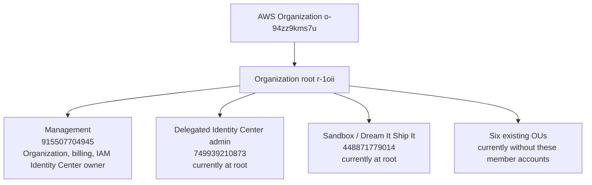
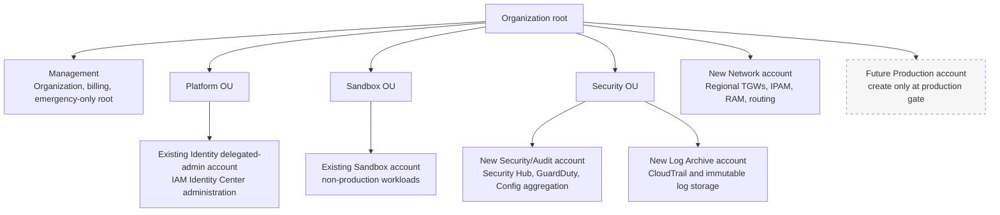
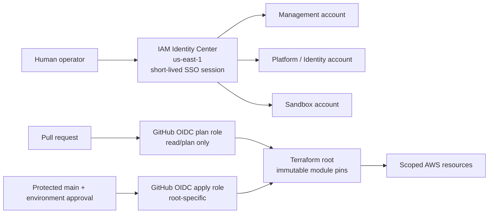
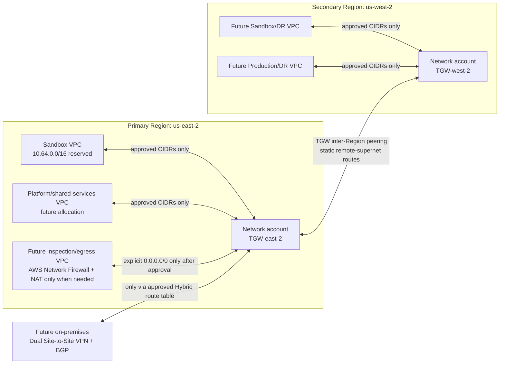

# AWS platform architecture

**Status:** Current-state discovery and proposed target.
**Last validated:** 2026-09-29, using read-only AWS Organizations, IAM Identity
Center, IAM, CloudTrail, Config, and sandbox service APIs.
**Module implementation refreshed:** 2026-10-06. This does not refresh or
change the live AWS baseline date above.
**Change authority:** This document is architecture guidance, not approval to
change AWS. The protected GitHub OIDC Terraform workflow remains the only
supported apply path.

## Executive design

The platform is an AWS-native, US-only landing zone for private, low-latency
applications with Cognito-based authentication and authorization. It uses AWS
Organizations, IAM Identity Center for humans, GitHub OIDC for automation, and
Terraform roots that consume immutable `aws.modules.*` release pins.

The initial landing zone uses the minimum practical separation: six accounts.
The sixth account is a dedicated Network account because a secure hub/spoke
Transit Gateway must not share its blast radius with Identity Center or a
workload. Production remains deferred until its gate is approved. This keeps
the design below the ten-account quota while preserving the security boundaries
needed now.

1. Keep the Organizations management account as a control and billing plane;
   never run workloads there.
2. Place the existing delegated Identity Center account in `Platform` and the
   existing sandbox account in `Sandbox` only through a reviewed adoption plan.
3. Create separate `Security`, `Log Archive`, and `Network` member accounts
   only after the root-MFA prerequisite and account-vending plan are approved.
   The supplied Security and Log Archive root-email aliases are delivery inputs,
   not repository content; Network needs one additional explicitly supplied
   unique root-email alias.
4. Use `us-east-1` for the already-established IAM Identity Center control
   plane, `us-east-2` as the initial workload Region, and `us-west-2` only as a
   future US secondary Region after the live root SCP is corrected and tested.
   No non-US Region is in scope.
5. Keep Control Tower out of scope. Direct AWS Organizations plus Terraform
   GitOps is the approved landing-zone model.

## Live baseline

| Area | Confirmed state | Design implication |
|---|---|---|
| Organization | `o-94zz9kms7u`, all features enabled; management account `915507704945`; root `r-1oii`. | Adopt the existing Organization; do not create a second landing zone. |
| OUs | `Security`, `Platform`, `Workloads-Production`, `Workloads-NonProduction`, `Sandbox`, and `Suspended` already exist. | The target OU model is present; account placement is the missing step. |
| Account placement | Management, delegated Identity Center, and Sandbox accounts are all directly under the Organization root. | OU-specific guardrails do not apply to those member accounts yet. |
| Human identity | IAM Identity Center is owned by management in `us-east-1`; the delegated-admin account is `749939210873`; the current permission set is `AdministratorAccess` for four hours. | Retain the instance. Do not recreate or move it merely to match a workload Region. |
| Delivery | Root-specific GitHub plan, protected apply, drift, and guarded teardown workflows are present. | GitHub OIDC remains the only apply path; no console or local Terraform apply. |
| Application plane | No Terraform-tagged VPC, ECS cluster, Cognito pool, ECR repository, or TGW was found in the Sandbox account in `us-east-2`. | The application plane is currently absent and must be rebuilt only through approved roots. |
| Retained control plane | `platform-tf-lock-table` remains active in `us-east-2`. | This is a Terraform lock-table control-plane artifact, not an application workload. |
| Cost and centralized logging | No AWS Budgets objects, organization CloudTrail, or Config aggregator were observed through the management account. | Establish these before calling the landing zone security-operational. |
| Root MFA | `AccountMFAEnabled=0` was reported for all three accounts. | Root-MFA remediation is a manual stop condition before account vending or landing-zone changes. |

The live root SCP also currently denies material workload and networking actions
in `us-west-2`. Although the repository's intended region set includes that
Region, it is not deployable today. Treat this as a policy/source drift that
must be reviewed and tested in Sandbox before multi-Region work begins.

## Account topology

### Current placement

### Proposed minimum target

| Account | State | Target responsibility | Required next action |
|---|---|---|---|
| Management (`915507704945`) | Existing; remains at root. | Organizations, billing, Identity Center ownership, break-glass governance. | Enable and independently verify root MFA; keep workloads out. |
| Platform / Identity (`749939210873`) | Existing; currently at root. | IAM Identity Center delegated administration and shared delivery governance. | Import/adopt, then move to `Platform` through a reviewed plan. |
| Sandbox (`448871779014`) | Existing; currently at root. | Non-production workload and validation account. | Import/adopt, then move to `Sandbox` through a reviewed plan. |
| Security/Audit | Not yet created. | Delegated security services, findings, Config aggregation, read-only audit access. | Create only from the approved supplied root-email input. |
| Log Archive | Not yet created. | Central organization CloudTrail and durable security-log storage. | Create only from the approved supplied root-email input. |
| Network | Not yet created. | Regional TGWs, IPAM, RAM sharing, route governance, and later VPN/BGP. | Supply a unique root email; create before any TGW or spoke VPC. |
| Production | Deferred. | Isolated production workload plane. | Require a production service, SLO, data, and recovery decision first. |

## Identity and delivery architecture

| Principal | Credential | Current state | Target boundary |
|---|---|---|---|
| Human administrator | IAM Identity Center session | Administrative access exists. | Use named, least-privilege permission sets; retain a tightly controlled management break-glass path. |
| Identity administrator | IAM Identity Center delegated admin | Delegation to account `749939210873` is active for `sso.amazonaws.com` and `account-access.amazonaws.com`. | Administer workforce access from Platform; do not use root credentials for daily work. |
| Platform engineer | IAM Identity Center session | A separate least-privilege model is not yet demonstrated. | Scope to non-production accounts and approved operational roles. |
| GitHub plan | GitHub OIDC | Root-specific plan workflows exist. | Read/plan only; never allow applies from untrusted pull requests. |
| GitHub apply | GitHub OIDC plus protected environment | Root-specific protected apply workflows exist. | Apply only the reviewed root and retain plan/drift evidence. |

## Regional, network, and workload design

| Concern | Initial design | Expansion gate |
|---|---|---|
| Regions | US only: Identity Center remains in `us-east-1`; initial workload Region is `us-east-2`. | `us-west-2` becomes secondary only after the root SCP permits the required services and a tested plan proves it. |
| Workloads | Private ECS Fargate services, ECR image digests, Cognito authentication, DynamoDB where appropriate, KMS encryption, and VPC endpoints. | Rebuild only after account adoption and the normal network → platform → workload delivery order. |
| End-user identity | A secure primary Cognito pool is available in the platform module; no pool is deployed today. | ADR 0024's AWSCC submodule can create an `INACTIVE` MRR secondary only after an eligible KMS-backed pool, signed module release, separate state/role, routing design, and activation evidence are approved. |
| Ingress | No public ingress by default. The edge blueprint repository now composes private S3, CloudFront OAC, ACM, WAF, encrypted logs, and Route 53, but no active root consumes it. | Require a signed blueprint release, owned domain, public-root state/role, OAuth callbacks, SLO, rollback, and reviewed plan before exposure. |
| Multi-account networking | No TGW, RAM, IPAM, VPN, or BGP deployed today. | Create a dedicated Network account only when the TGW/hybrid design inputs are approved. |
| On-premises connectivity | Not deployed. | Require two customer-gateway IPs per Region, BGP ASN, prefixes, route-leak matrix, monitoring, and incident owner. |

## Hub-and-spoke network contract

The primary network hub is a Transit Gateway (TGW) in `us-east-2`, owned only
by the Network account. A second TGW in `us-west-2` is the future regional hub;
the two hubs use an inter-Region TGW peering attachment. No VPC peering mesh,
direct workload-to-workload peering, or default-anywhere routing is permitted.

### Route-table matrix

TGW default association and default propagation are disabled. Each attachment
has one association, and route propagation is explicit and reciprocal. VPC
route tables must also contain the approved return route to the TGW; a TGW
route alone does not create end-to-end connectivity.

| TGW route table | Associated attachments | Receives propagated/static routes from | May route to | Explicitly prohibited |
|---|---|---|---|---|
| `spoke-sandbox` | Sandbox VPC attachments | Only approved Platform, Shared Services, and later Hybrid prefixes. | Named shared services and approved on-premises prefixes. | Other Sandbox/Production spokes and `0.0.0.0/0`. |
| `shared-services` | Platform/shared-services attachments | Approved Sandbox and Production prefixes. | Only services explicitly published to the consuming spoke. | Implicit full-mesh routing. |
| `inspection-egress` | Inspection/egress VPC attachment | Approved spoke prefixes. | Spokes; `0.0.0.0/0` only after firewall and egress approval. | Bypassing the inspection VPC for centralized egress. |
| `hybrid` | VPN or Direct Connect attachment | Only on-premises prefixes and explicitly permitted spoke prefixes. | Approved AWS prefixes through reciprocal propagation. | Advertising all VPC CIDRs or default routes without review. |
| `inter-region` | TGW peering attachment | Static regional-supernet routes only. | Remote Region prefixes explicitly allowed by both hubs. | Dynamic propagation over TGW peering and transit through an unrelated third Region. |

The initial Network-account build must include TGW flow logs, RAM sharing only
with the approved Platform and Sandbox accounts, dedicated TGW attachment
subnets in at least two Availability Zones, and route-table tags that identify
owner, source account, destination class, and change ticket. The existing
`10.64.0.0/16` Sandbox allocation is reserved; the broader IPAM supernet and
all other CIDRs remain subject to an on-premises overlap check.

## SCP replacement contract

The current root policy `AdvancedModeRegionRestrictionSecurityControlPolicy`
must **not** be deleted first. It currently provides the only region boundary
for accounts at the Organization root, but it also blocks required VPC/TGW work
in `us-west-2`. Replace it in a controlled sequence:

1. Preserve `ManagedAccountSecurityControlPolicy`: it blocks organization
   escape and protection-bypass actions on managed roles.
2. Preserve the Organization-escape deny policy.
3. Create and test a versioned `deny-non-us-regions` SCP that denies all
   non-US Regions while allowing the required global-service exceptions and
   the three approved US control/workload Regions: `us-east-1`, `us-east-2`,
   and `us-west-2`.
4. Move the Sandbox account to its OU and verify that both `us-east-2` and
   `us-west-2` VPC/TGW read-only APIs are allowed while a non-US Region is
   denied. Repeat for Platform.
5. Attach the replacement policy at the approved OU scope, review its
   effective impact, then detach the advanced root policy. The management
   account remains a separate root-security concern because SCPs do not
   restrict it.
6. Add workload guardrails separately: deny leaving the Organization, deny
   disabling central logging/security services, restrict unapproved Regions,
   deny public S3 posture changes, and protect tagged Terraform state. Do not
   make an allow-list SCP until service usage is measured.

This is a **replacement**, not a removal of region controls. AWS recommends
testing restrictive SCPs on a limited OU/account before broad attachment.

## Minimum security and cost baseline

These are the minimum controls for the initial six-account landing zone. They
are proposed work, not deployed resources.

1. Enable and verify root MFA for the management account and resolve the
   member-account root-access strategy. AWS recommends MFA for root users and
   temporary, federated credentials for ordinary access.
2. Import and place the two existing member accounts before attaching their
   OU-specific SCP controls. Test every restrictive SCP in Sandbox first.
3. Create the Security/Audit, Log Archive, and Network accounts from reviewed
   inputs; then configure an organization CloudTrail to Log Archive, Config
   aggregation, GuardDuty, Security Hub, and centralized findings ownership in
   Security/Audit.
4. Apply encryption, public-access prevention, and retention controls through
   Terraform modules and root-specific GitOps workflows. Do not use a console
   change as a substitute for source, plan, and evidence.
5. Establish an initial consolidated **$500/month** cost budget with an 80%
   actual-spend alert and a 100% forecast alert, plus the required billing
   notification recipients. This is the startup-prompt baseline and must be
   reviewed before it is committed or applied.

## Delivery sequence and gates

| Gate | Outcome required before the next gate | Delivery boundary |
|---|---|---|
| 0. Root security | Root MFA manually enabled and verified for management; recovery ownership documented. | Manual AWS root-user action; never Terraform or an access key. |
| 1. Organization adoption | Import/move plan for existing member accounts, including rollback and expected policy effects. | Organization Terraform PR and protected plan only. |
| 2. Minimal account foundation | Security/Audit, Log Archive, and Network account inputs approved; OU placement and account baseline defined. | Organization Terraform PR; no inferred email aliases. |
| 3. Network hub | IPAM overlap check, TGW route matrix, RAM share scope, and the US-only SCP replacement are approved. | New Network root, state, OIDC role, and protected workflow. |
| 4. Central security and cost | Organization trail, log storage, Config aggregation, security services, budget, and alerts planned with clear ownership. | New scoped Terraform roots, state, OIDC roles, and protected workflows. |
| 5. Rebuild Sandbox | Network, platform, and workload plans show only expected resources. | Existing ordered sandbox root workflows. |
| 6. Hybrid / multi-Region | VPN/BGP or inter-Region routes, route domains, and regional policy are approved. | Network root extension and protected workflow. |
| 7. Production | Service SLO, data recovery, edge, incident, capacity, and cost evidence are accepted. | New Production root/account and protected workflow. |

## Known reconciliation work

- `docs/PROJECT-STATUS.md`, the ConOps, and the roadmap are updated alongside
  this document to distinguish historical sandbox code from the currently
  empty application plane.
- The live root-level regional SCP is stricter than the repository's intended
  US-region policy. Do not attempt `us-west-2` deployment until its ownership,
  policy content, and test plan are reviewed.
- The organization root README still records a CloudFormation-owned legacy
  state bootstrap. Replacing or retiring that bootstrap needs its own migration
  ADR and state-preservation plan; it is not an account-adoption side effect.

## Operator rules

- No static AWS keys, local `terraform apply`, console provisioning, manual
  state edits, or unreviewed account moves.
- Do not commit root-account email addresses, recovery details, or budget
  notification recipients to this repository.
- A Terraform plan is evidence of proposed change, not approval. Apply only
  through the matching protected GitHub OIDC workflow.
