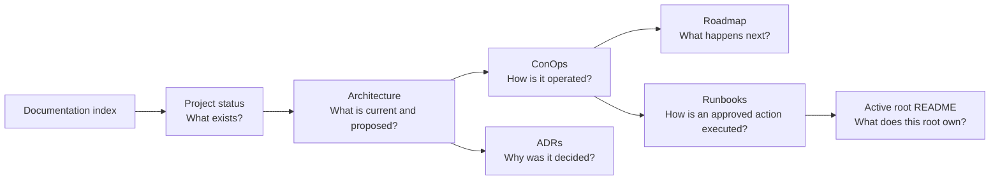

# Platform documentation

This is the single documentation entry point for the repository. The files
below have separate responsibilities; no dated review, prompt, or runbook
overrides the current-state and decision records.

## Read in this order

1. [Project status](PROJECT-STATUS.md) — begin with what was last observed in
   AWS, what is absent, the current gate, and the evidence date.
2. [Architecture overview](ARCHITECTURE.md) — understand the current topology,
   proposed target, security boundaries, and delivery gates.
3. [Platform ConOps](operations/conops.md) — understand who operates the
   platform and the only supported change lifecycle.
4. [Roadmap](ROADMAP.md) — see the approved sequence of future outcomes; it is
   not executable infrastructure.
5. Use the [ADR index](adr/README.md), [runbook index](runbooks/README.md),
   [module catalog](MODULE-REPOSITORIES.md), or an active root README only when
   the first four documents direct you there.



## Documentation authority

Authority is assigned by question, not by whichever file was edited last.
When current-state claims matter operationally, refresh them with read-only AWS
evidence before approving a change.

| Question | Authoritative location | Boundary |
|---|---|---|
| What was last observed in AWS, and when? | [Project status](PROJECT-STATUS.md) | A timestamped snapshot; revalidate drift-prone facts. |
| What architecture exists or is proposed? | [Architecture overview](ARCHITECTURE.md) | Clearly separates current state from target design. |
| Why was an architecture or delivery choice made? | [Accepted, non-superseded ADRs](adr/README.md) | Proposed, closed, and superseded records are not approval. |
| How is the platform changed and operated? | [Platform ConOps](operations/conops.md) | Defines roles, order, evidence, and stop conditions. |
| What may be built next? | [Roadmap](ROADMAP.md) | Ordered gates only; not an apply authorization. |
| What code can change AWS? | [`infra/active`](../infra/README.md) and each root README | The only executable Terraform tree. |
| How is an approved operation performed? | [Runbooks](runbooks/README.md) | A procedure still requires its normal plan and approvals. |
| Where does reusable Terraform live? | [Module catalog](MODULE-REPOSITORIES.md) | Modules live in independently released repositories. |

## Change flow

```text
need -> ADR when a decision changes -> module release or active-root change
     -> pull-request plan -> protected OIDC apply -> live verification
     -> no-change/drift evidence -> documentation update
```

| Change made | Documentation that must change in the same pull request or immediately after verified apply |
|---|---|
| Observed AWS state, deployed capability, or current gate | `PROJECT-STATUS.md`, including the validation date and evidence boundary. |
| Architecture, security boundary, account, Region, route, or ownership decision | New/amended ADR plus `ARCHITECTURE.md`; update `ROADMAP.md` if gate order changed. |
| Delivery or operating procedure | ConOps plus the affected runbook. |
| Active Terraform root responsibility or dependency | The root README and `infra/README.md` when the root inventory changes. |
| Module owner or immutable consumer pin | Owning module repository and `MODULE-REPOSITORIES.md`. |
| Formal assessment | A dated directory under `reviews/` that links back to current status; never rewrite current state from the review alone. |

## Reference material

| Reference | Classification |
|---|---|
| [Well-Architected Review — 2026-09-29](reviews/well-architected-2026-09-29/README.md) | Dated read-only evidence and recommendations. Findings may become stale and do not override current status. |
| [AWS module catalog assessment — 2026-10-06](reviews/aws-modules-faang-analysis-2026-10-06/README.md) | Dated module-integration assessment. Scores and findings are historical and require verification against current releases. |
| [Platform implementation brief](PLATFORM_IMPLEMENTATION_PROMPT.md) | Reusable planning prompt. It is not source of truth, an ADR, a runbook, or permission to apply. |
| Git history | Retired and superseded material for forensic comparison only. |

## Maintenance rules

- Link to an owning document instead of copying its current-state narrative.
- Use one ADR number and an explicit status; update the index when status
  changes.
- Keep executable Terraform only under `infra/active`; documentation and
  examples are never alternate deployment paths.
- Put exact commands in runbooks, not architecture or status documents.
- Never commit credentials, root-account recovery details, personal data, or
  secret notification targets.
- Documentation is not approval to change AWS. A change still needs its root
  plan, review, protected environment approval, and post-apply evidence.
