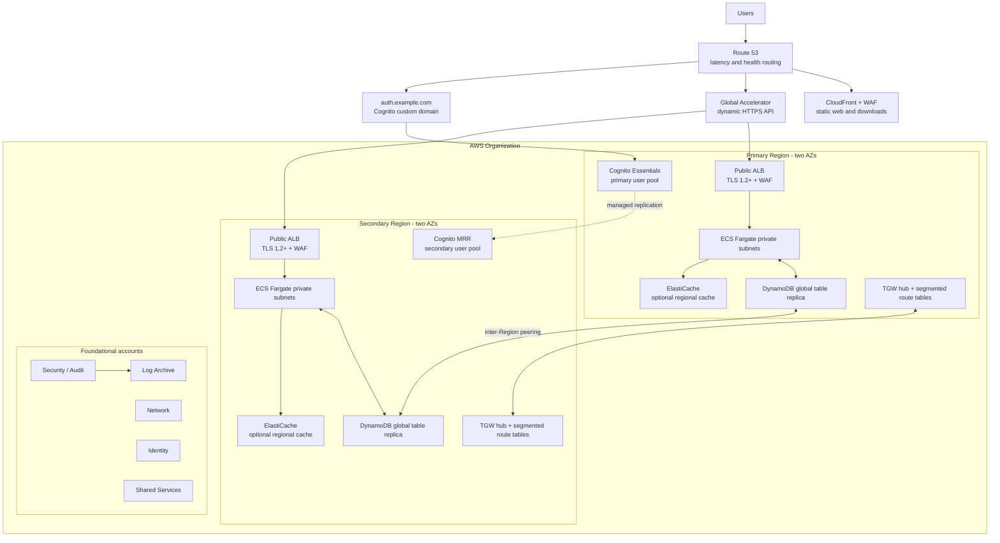

# Proposed AWS multi-account, multi-Region platform

**Status:** Phase 7 source package is complete and its credential-free GitOps source is published in `hatan4ik/devops-aws-infra` as of 2026-09-18. No AWS account, resource, Terraform state, AWS OIDC role, GitHub environment, or branch rule has been configured.
**Scope:** AWS-native platform design and GitOps source for a low-latency application serving millions of authenticated users. The repository is not deployment evidence and has not created cloud infrastructure.

The design is active-active for stateless application and DynamoDB profile/session traffic across two Regions and two AZs per Region. Cognito is intentionally a native multi-Region **primary/secondary directory**: the secondary is activated for authentication and failover, but user creation, password resets, and profile writes remain primary-Region operations. This distinction is material to the stated RTO/RPO and product experience.

## Architecture at a glance



## Decision index

| ADR | Recommendation |
|---|---|
| [0001](../adr/0001-control-tower-account-vending.md) | AWS Control Tower with Account Factory for Terraform and a dedicated AFT management account. |
| [0002](../adr/0002-regional-availability-and-data.md) | Active-active application/data plane; Cognito managed replication for a primary/secondary identity directory. |
| [0003](../adr/0003-segmented-tgw-ipam-and-encryption.md) | Regional TGW hubs, IPAM, encryption controls, RAM sharing, explicit deny-by-default route segmentation. |
| [0004](../adr/0004-edge-ingress-and-egress.md) | CloudFront/WAF for static delivery; Global Accelerator to regional ALBs for dynamic API; no Internet egress by default. |
| [0005](../adr/0005-hybrid-connectivity.md) | Dual Site-to-Site VPN/BGP connections per Region to TGW; Direct Connect only after a costed demand case. |
| [0006](../adr/0006-identity-and-authorization.md) | Cognito Essentials with managed multi-Region replication; Verified Permissions only for selected fine-grained decisions. |
| [0007](../adr/0007-compute-and-data.md) | ECS Fargate baseline; DynamoDB global tables for profiles/sessions; Aurora Global and ElastiCache are conditional. |
| [0008](../adr/0008-security-and-state.md) | Organization-wide preventive/detective controls, KMS/Secrets Manager, and an S3/DynamoDB state design. |
| [0009](../adr/0009-observability-and-sre.md) | Central observability/security accounts, CloudWatch/OAM/ADOT, SLOs, tested failover operations. |
| [0010](../adr/0010-repository-and-module-topology.md) | Hybrid live-root/module topology, three initial independently released modules, and planned GitHub controls. |
| [0011](../adr/0011-cognito-mrr-provider-boundary.md) | Do not substitute CLI/console steps for Terraform-managed Cognito MRR; block it pending provider support. |
| [0012](../adr/0012-oidc-gated-terraform-delivery.md) | Separate OIDC plan/apply/drift roles, protected execution environments, SHA-pinned CI, and no automatic remediation. |
| [0013](../adr/0013-layered-verification-no-automatic-fault-injection.md) | Layered credential-safe verification; controlled game days rather than automatic disruptive tests. |

## Account and OU topology

```mermaid
flowchart TB
  management[Management account
Organizations + Control Tower]
  management --> securityOU[Security OU]
  management --> platformOU[Platform OU]
  management --> workloadsOU[Workloads OU]
  management --> sandboxOU[Sandbox OU]
  securityOU --> audit[Security / Audit
GuardDuty & Security Hub delegated admin]
  securityOU --> archive[Log Archive]
  platformOU --> identity[Identity
IAM Identity Center delegated admin]
  platformOU --> network[Network
TGW, IPAM, Resolver]
  platformOU --> shared[Shared Services
state backends, CI support]
  platformOU --> aft[AFT Management]
  workloadsOU --> prod[Workload prod account(s)]
  workloadsOU --> nonprod[Workload dev & staging account(s)]
  sandboxOU --> ephemeral[Ephemeral test accounts]
```

The Control Tower-created Audit account is the Security/Audit account in this diagram. Management has no workload resources, no daily human administration, and is never a CI deployment target.

## Supporting documents

- [Network and security design](network-security.md)
- [Application, identity, and data design](platform.md)
- [SLOs, operations, and game day](operations.md)
- [Indicative cost estimate](cost-estimate.md)
- [External verification checklist](external-verification.md)
- [AWS primary-source references](sources.md)
- [Phase 3 requirement traceability](phase-3-traceability.md)
- [Repository and module strategy](repository-strategy.md)
- [Planned GitHub repository controls](github-repository-controls.md)
- [Phase 4 requirement traceability](phase-4-traceability.md)
- [Phase 5 implementation traceability](phase-5-traceability.md)
- [Phase 6–7 delivery and verification traceability](phase-6-7-traceability.md)
- [Operational runbooks](../runbooks/README.md)
