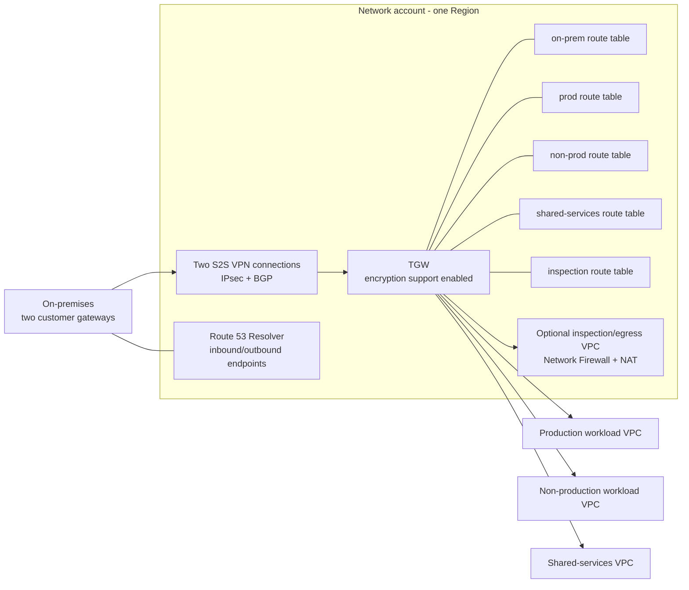

# Network and security design

## Account and network boundaries

Every workload receives an account and a VPC in each selected Region. CIDRs are allocated by AWS VPC IPAM from the approved enterprise pool, never supplied ad hoc. The current `10.128.0.0/9` placeholder in [the assumptions](../ASSUMPTIONS.md) is invalid until the enterprise routing team confirms it does not overlap on-premises, acquired networks, or another cloud.

The Network account owns one Transit Gateway per Region, AWS RAM shares, IPAM, Route 53 Resolver endpoints/rules, and an optional inspection/egress VPC. Workload accounts own their VPCs and only their TGW attachment and VPC route entries. Cross-account acceptance and route programming are deliberately separate Terraform roots.

## Route segmentation and traffic policy

TGW default route-table association and propagation are disabled. Each attachment has one explicit association; propagation happens only to required route tables. Static routes are used for TGW peering. No route is a permission: security groups, NACLs where justified, workload identity, and TLS still enforce access.

| Source segment | Permitted destinations | Enforcement |
|---|---|---|
| Production | Production shared services explicitly required by service contract; on-premises approved prefixes; regional private AWS endpoints. | `prod` TGW route table, workload security groups, PrivateLink endpoint policies. |
| Non-production | Non-production shared services and approved test dependencies. | Separate `non-prod` route table; no propagation into production. |
| Shared services | Required workload services only, such as Resolver, centralized endpoints, monitoring collectors, and approved CI. | `shared` table plus per-service security groups. |
| Inspection/egress | Only approved outbound destinations, after a formal egress exception. | `inspection` table, Network Firewall policy, NAT, DNS Firewall, logs. |
| On-premises | Explicit approved workload prefixes only. | `on-prem` table with BGP prefix filters, customer-gateway ACLs, and security groups. |

The baseline has no `0.0.0.0/0` or `::/0` Internet route from workload subnets. Gateway endpoints (S3/DynamoDB) and interface endpoints are preferred for AWS service calls. If an application needs a third-party public endpoint, the exception is routed through the regional inspection/egress VPC. It does not create a NAT gateway in every workload VPC.

## Ingress, DNS, and encryption

- Public DNS: use Route 53 latency routing for regional API/health endpoints and health checks. Use geolocation routing only when a confirmed legal, residency, or content-locality rule requires it; it is not a proxy for latency routing.
- Static web content and downloads: Route 53 to CloudFront, protected by a global WAF web ACL. S3 origins use Origin Access Control; buckets have Block Public Access.
- Dynamic HTTPS API: Route 53 aliases to Global Accelerator, then to a public ALB in each Region. The only justified public subnets are the two ALB subnets; tasks and data remain private. Each ALB uses an ACM certificate, HTTPS-only listener, TLS 1.2+ policy, regional WAF web ACL, and health checks.
- Cognito: `auth.example.com` uses the Cognito custom-domain managed failover associated with the MRR primary/secondary user pools. Application SDK/API calls implement the same regional health decision.
- Private DNS: Route 53 private hosted zones are associated to workload VPCs by RAM. Route 53 Resolver inbound endpoints provide AWS name resolution to on-premises; outbound endpoints/rules forward approved on-premises zones. Resolver endpoints have two IPs in separate AZs.
- Inter-VPC traffic: enable VPC Encryption Controls in enforce mode where supported and TGW encryption support. This encrypts VPC-to-TGW lanes; all application protocols also use TLS 1.2+ so encryption remains end-to-end across every hop.
- Inter-Region: TGW peering carries only explicit static prefixes. It is not a substitute for application-level TLS, data replication controls, or regional Resolver endpoints; private DNS resolution is configured per Region.
- Hybrid: each VPN connection is IPsec, uses IKEv2 with approved current cryptographic proposals, and runs eBGP. Only summarized, non-overlapping prefixes are advertised. BGP max-prefix filters, AS-path policy, and CloudWatch tunnel-state alarms are mandatory.

## Security controls

| Control | Design enforcement |
|---|---|
| Human access | IAM Identity Center, phishing-resistant MFA where available, least-privilege permission sets, short-lived sessions, and break-glass monitoring. No daily IAM users or access keys. |
| Machine access | GitHub Actions OIDC; repository, branch/tag, workflow, environment, and audience claims restrict each deploy role. No static AWS credentials. |
| Compute access | IMDSv2 is required on any exceptional EC2 use; Session Manager replaces inbound SSH and hosts have no public IP by default. |
| Encryption at rest | Account EBS default encryption, S3 SSE-KMS, KMS customer-managed keys for sensitive resources, multi-Region KMS key for Cognito MRR, and Secrets Manager for secrets/rotation. |
| Preventive governance | Member-account SCPs deny leaving the organization, routine root activity, security-service disablement, unapproved Regions, public S3, and unsupported unencrypted resource creates. Management-account root is separately hardened because SCPs do not apply there. SCPs are supplemented by service-level policy because an SCP cannot enforce all encryption semantics. |
| Detective governance | Organization CloudTrail to Log Archive, AWS Config/conformance packs, GuardDuty, Security Hub AWS Foundational/CIS standards, Inspector, IAM Access Analyzer, VPC Flow Logs, and Macie only for confirmed PII stores. |
| Edge defense | Shield Standard, WAF managed rules, rate limits, log delivery, and separate high-cost bot/fraud controls only after abuse telemetry supports the spend. Shield Advanced is a finance/security decision, not a default. |
| Incident evidence | Immutable/versioned encrypted log archive; S3 Object Lock where the compliance retention decision requires it; CloudWatch and security findings routed to Security/SRE responders. |

## Cost-sensitive egress decision

Network Firewall is not deployed before a workload has approved Internet egress. This keeps the initial high-security baseline at **no Internet egress**, rather than paying for an unused inspection path. Once an exception is approved, the centralized two-AZ inspection/egress VPC is mandatory for that egress class. Its published US-East fixed price benchmark is `$0.395/hour` per firewall endpoint: four endpoints across two Regions are about `$1,153/month` before data processing. Matching NAT gateway hourly and data-processing charges are waived only when AWS Network Firewall and NAT are in the same service chain; standard data-transfer charges still apply.
