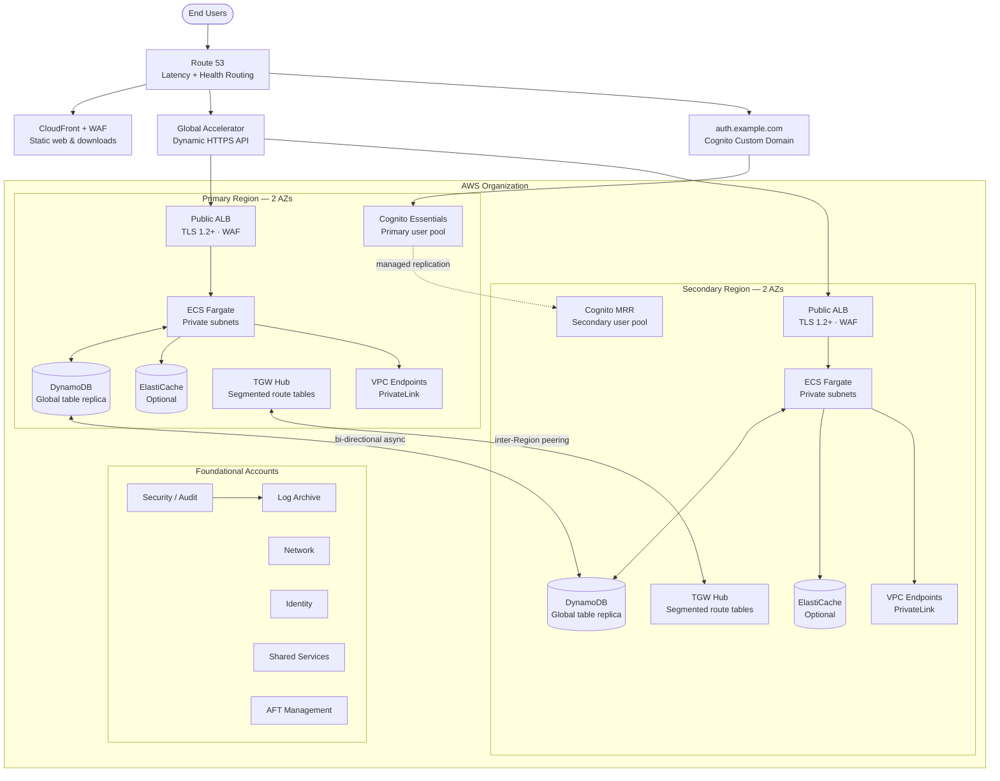
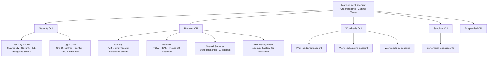
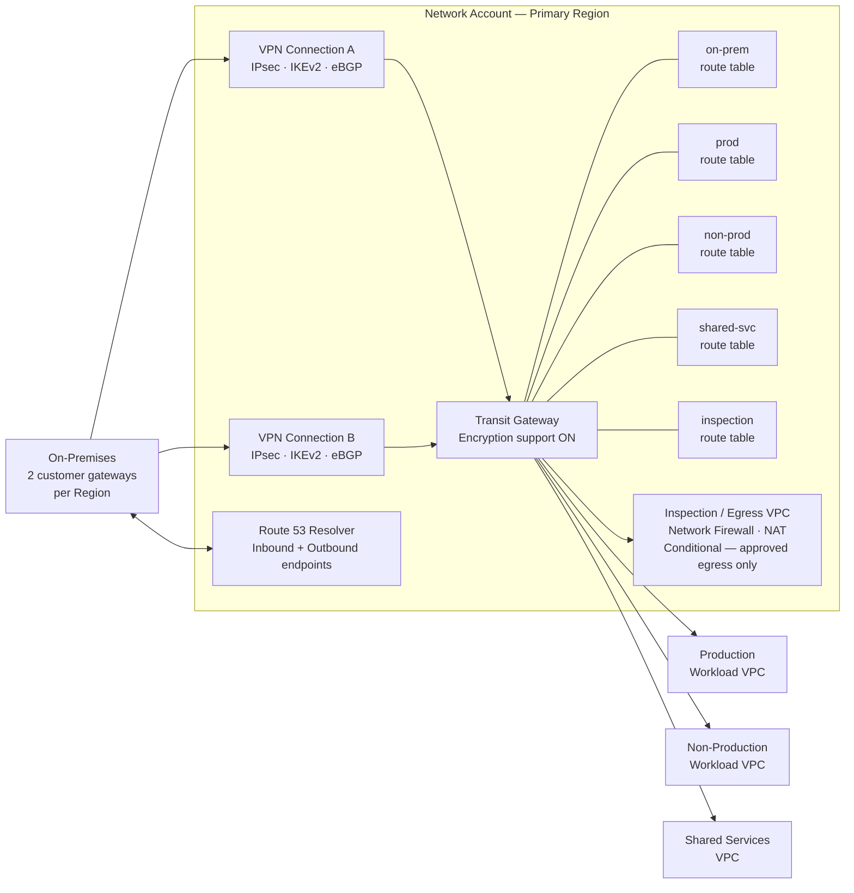
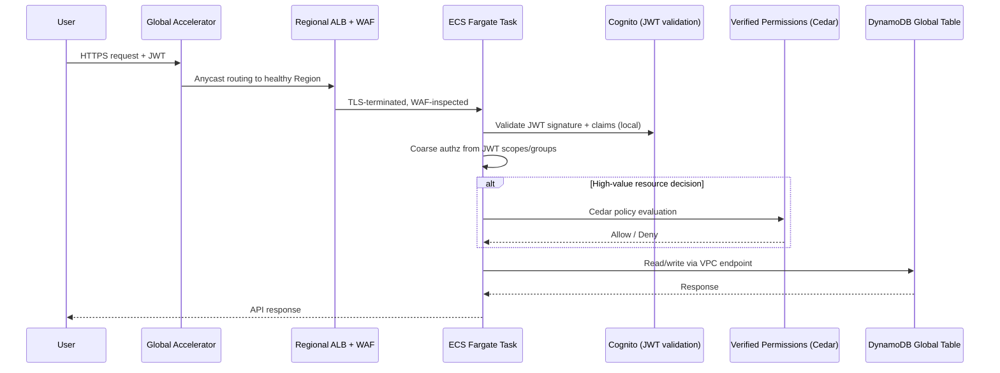
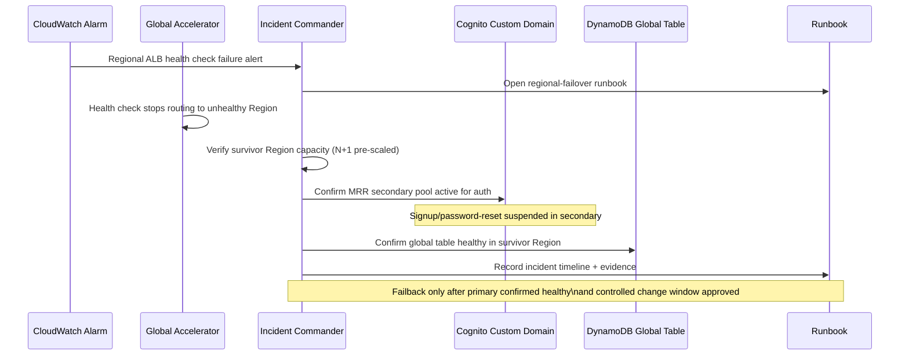

# Chapter 2 — Architecture Reference

**Status:** Stakeholder-approved 2026-09-18 · No application-platform resources created; see ADR 0015 for the separately observed state bootstrap

---

## 2.1 Architecture at a glance

The platform is an active-active, two-Region, multi-account AWS architecture. Stateless application traffic and DynamoDB data are fully active in both Regions. Cognito identity is primary/secondary: the secondary Region can authenticate and issue tokens but cannot create users or perform profile writes.

---

## 2.2 AWS account and OU topology

**Key rules:**
- Management account has no workload resources and is never a CI deployment target
- Management root user has no access keys, is MFA-protected, and alerts on any use
- SCPs apply to all member accounts; Management account root is separately hardened
- AFT Management is isolated in Platform OU; its bootstrap is a one-time, separately approved action

---

## 2.3 Network topology

---

## 2.4 CI/CD delivery pipeline

```mermaid
flowchart LR
  dev[Developer\nlocal branch]
  pr[Pull Request\ngithub.com]

  subgraph quality[Quality Gate — no AWS credentials]
    fmt[terraform fmt]
    validate[terraform validate]
    lint[TFLint]
    test[terraform test\nprovider mocks]
    checkov[Checkov\nIaC policy]
    trivy[Trivy\nHIGH/CRITICAL]
    docs[terraform-docs\ndrift check]
  end

  subgraph plan[Plan Gate — OIDC plan role]
    tfplan[terraform plan]
    cost[Infracost\nbase/head diff]
  end

  subgraph gate[Human Gate — GitHub Environment]
    review[2 approvals\nCODEOWNER review\nstale dismissal]
  end

  subgraph apply[Apply Gate — OIDC apply role]
    replan[terraform plan\nre-run]
    tfapply[terraform apply\nstate lock]
  end

  dev --> pr --> quality --> plan --> gate --> apply
```

---

## 2.5 Data flow — authenticated API request

---

## 2.6 Regional failover sequence

---

## 2.7 Design assumptions summary

| ID | Assumption | Must be validated by |
|---|---|---|
| A-01 | 5M registered users, 1M MAU, 250K peak concurrent sessions | Product analytics |
| A-02 | 300 UserAuthentication RPS per Region | Load test + Cognito quota purchase |
| A-03 | 10,000 API RPS globally; either Region carries full load | API benchmark + load test |
| A-04 | Auth p50 ≤250 ms, p99 ≤600 ms; API p50 ≤100 ms, p99 ≤250 ms | Synthetic tests from user geographies |
| A-05 | API availability SLO 99.99%; auth journey SLO 99.9% | Contract/SLA review |
| A-06 | RTO ≤60 min regional failover; RPO ≤5 min DynamoDB; RPO ≤24 h audit logs | Business continuity approval |
| A-07 | `us-east-2` / `us-west-2` are pricing benchmarks only, not chosen Regions | User geography + data residency review |
| A-13 | `10.128.0.0/9` is available for IPAM — placeholder only | Enterprise IPAM + on-premises conflict review |

Full assumption register: [docs/ASSUMPTIONS.md](../ASSUMPTIONS.md)
