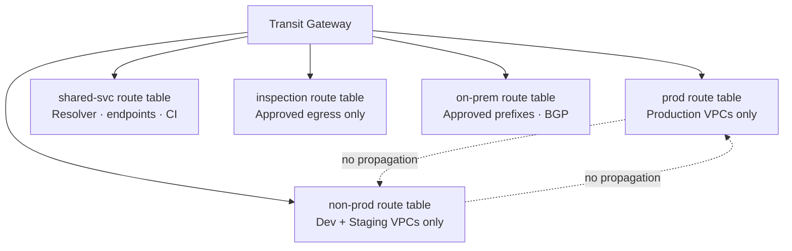
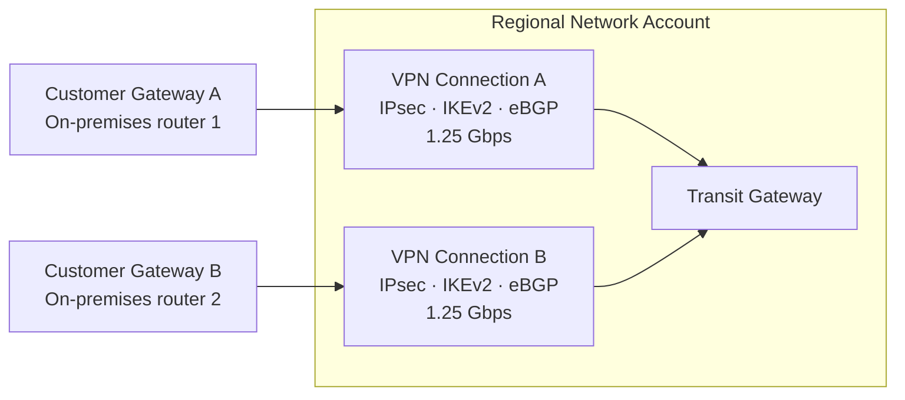
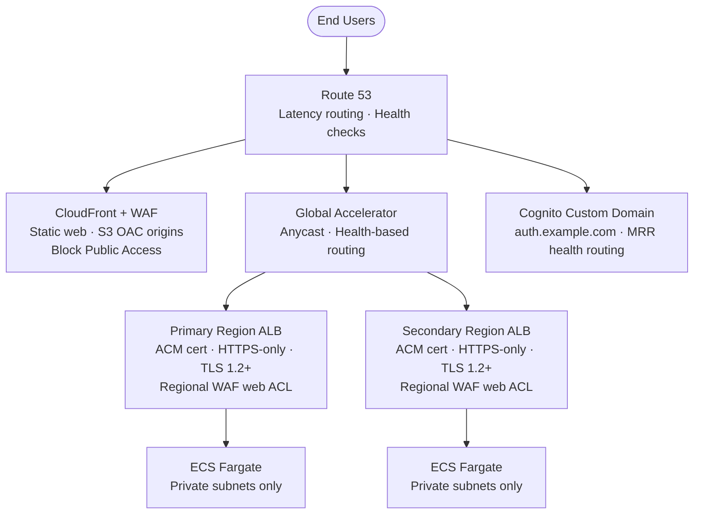
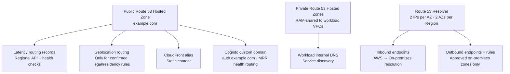

# Chapter 3 — Network & Security Design

**Status:** Stakeholder-approved 2026-09-18 · No AWS resources created  
**ADRs:** [0003](../adr/0003-segmented-tgw-ipam-and-encryption.md) · [0004](../adr/0004-edge-ingress-and-egress.md) · [0005](../adr/0005-hybrid-connectivity.md) · [0008](../adr/0008-security-and-state.md)

---

## 3.1 Network account ownership model

The Network account is the single owner of all transit infrastructure. Workload accounts own only their VPC and their TGW attachment.

| Resource | Owner account | Terraform root |
|---|---|---|
| Transit Gateway (one per Region) | Network | `<org>-aws-platform-network` |
| IPAM pool and CIDR allocations | Network | `<org>-aws-platform-network` |
| TGW route tables (prod / non-prod / shared / inspection / on-prem) | Network | `<org>-aws-platform-network` |
| TGW inter-Region peering attachment | Network | `<org>-aws-platform-network` |
| Route 53 Resolver inbound/outbound endpoints | Network | `<org>-aws-platform-network` |
| Inspection/egress VPC (conditional) | Network | `<org>-aws-platform-network` |
| Workload VPC, subnets, endpoints | Workload account | `<org>-aws-platform-workload-<app>` |
| TGW VPC attachment + route entries | Workload account | `<org>-aws-platform-workload-<app>` |

---

## 3.2 TGW route segmentation

Default route-table association and propagation are **disabled**. Every attachment has exactly one explicit association. No route is a permission — security groups, NACLs, workload identity, and TLS still enforce access independently.

| Source segment | Permitted destinations | Enforcement |
|---|---|---|
| Production | Production shared services; approved on-premises prefixes; regional private AWS endpoints | `prod` TGW route table · workload security groups · PrivateLink endpoint policies |
| Non-production | Non-production shared services and approved test dependencies | Separate `non-prod` table; no propagation into production |
| Shared services | Required workload services only (Resolver, centralized endpoints, monitoring, approved CI) | `shared` table + per-service security groups |
| Inspection/egress | Only approved outbound destinations after a formal egress exception | `inspection` table · Network Firewall policy · NAT · DNS Firewall · logs |
| On-premises | Explicit approved workload prefixes only | `on-prem` table · BGP prefix filters · customer-gateway ACLs · security groups |

**Baseline rule:** No `0.0.0.0/0` or `::/0` Internet route from any workload subnet. Third-party public endpoints route through the regional inspection/egress VPC only after an approved exception.

---

## 3.3 Hybrid connectivity

**Requirements per Region:**
- Two independent customer-gateway devices with separate public IPs
- IKEv2 with current approved cryptographic proposals
- eBGP with summarized, non-overlapping prefix advertisements
- BGP max-prefix filters and AS-path policy mandatory
- CloudWatch tunnel-state alarms on both tunnels
- Direct Connect: not deployed initially; requires a costed demand case

---

## 3.4 Ingress and edge architecture

**Public subnet rule:** The only justified public subnets are the two ALB subnets per Region. All tasks, data, and internal services remain in private subnets.

---

## 3.5 Encryption controls

| Layer | Control |
|---|---|
| VPC-to-TGW | TGW encryption support enabled; VPC Encryption Controls enforce mode where supported |
| Application protocols | TLS 1.2+ on every hop regardless of network-layer encryption |
| Inter-Region TGW peering | Explicit static prefixes only; not a substitute for application TLS |
| Data at rest — EBS | Account-level EBS default encryption |
| Data at rest — S3 | SSE-KMS with customer-managed keys |
| Data at rest — DynamoDB | KMS CMK; multi-Region key for Cognito MRR |
| Secrets | AWS Secrets Manager with rotation; no plaintext secrets in state or environment variables |
| Hybrid VPN | IPsec with IKEv2 and approved current cryptographic proposals |

---

## 3.6 Security controls matrix

| Control domain | Implementation |
|---|---|
| **Human access** | IAM Identity Center · phishing-resistant MFA · least-privilege permission sets · short-lived sessions · break-glass monitoring · no daily IAM users or access keys |
| **Machine access** | GitHub Actions OIDC · repository/branch/environment/audience claims restrict each deploy role · no static AWS credentials |
| **Compute access** | IMDSv2 required on any EC2 use · Session Manager replaces SSH · no public IPs on hosts |
| **Preventive governance** | SCPs: deny org escape · restrict root activity · deny unapproved Regions · deny disabling security services · deny public S3 · restrict unencrypted resource creation |
| **Detective governance** | Org CloudTrail → Log Archive · AWS Config + conformance packs · GuardDuty · Security Hub (AWS Foundational + CIS) · Inspector · IAM Access Analyzer · VPC Flow Logs · Macie (PII stores only) |
| **Edge defense** | Shield Standard baseline · WAF managed rules + rate limits · log delivery · Shield Advanced and bot/fraud controls require documented risk decision |
| **Incident evidence** | Immutable versioned encrypted log archive · S3 Object Lock where compliance retention requires it · findings routed to Security/SRE on-call |

---

## 3.7 DNS architecture

**Rule:** Use latency routing for regional API/health endpoints. Use geolocation routing only when a confirmed legal, residency, or content-locality rule requires it — it is not a proxy for latency routing.

---

## 3.8 Network Firewall cost gate

Network Firewall is **not deployed** until a workload has an approved Internet egress exception.

| Scenario | Action |
|---|---|
| No approved Internet egress | No Network Firewall, no NAT gateway in workload VPCs |
| Approved egress exception granted | Centralized two-AZ inspection/egress VPC is mandatory for that egress class |
| Cost benchmark (US-East) | `$0.395/hour` per endpoint · 4 endpoints across 2 Regions ≈ `$1,153/month` before data processing |
