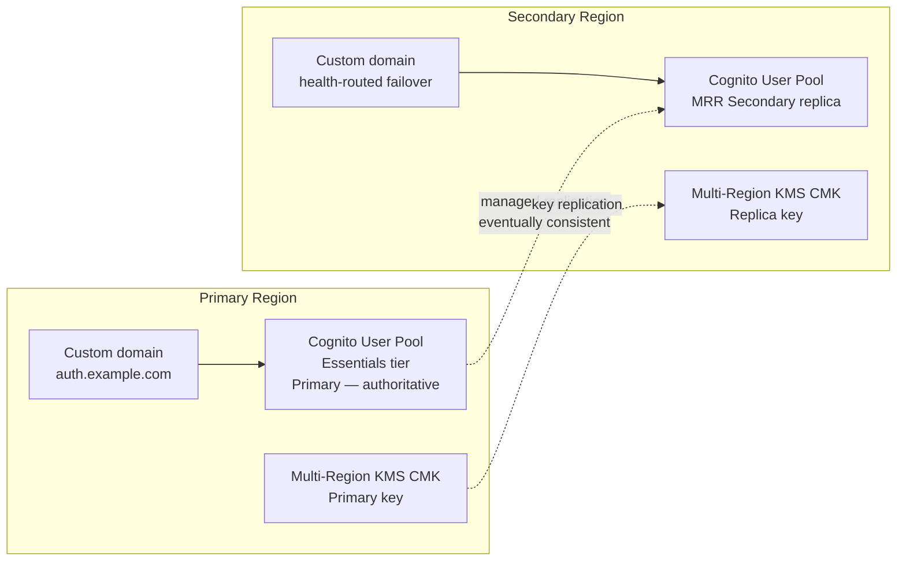
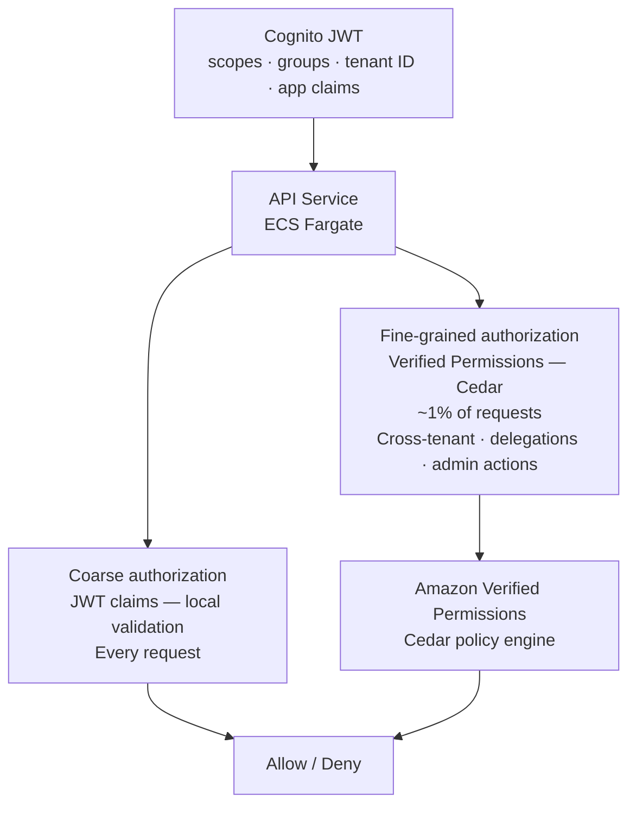
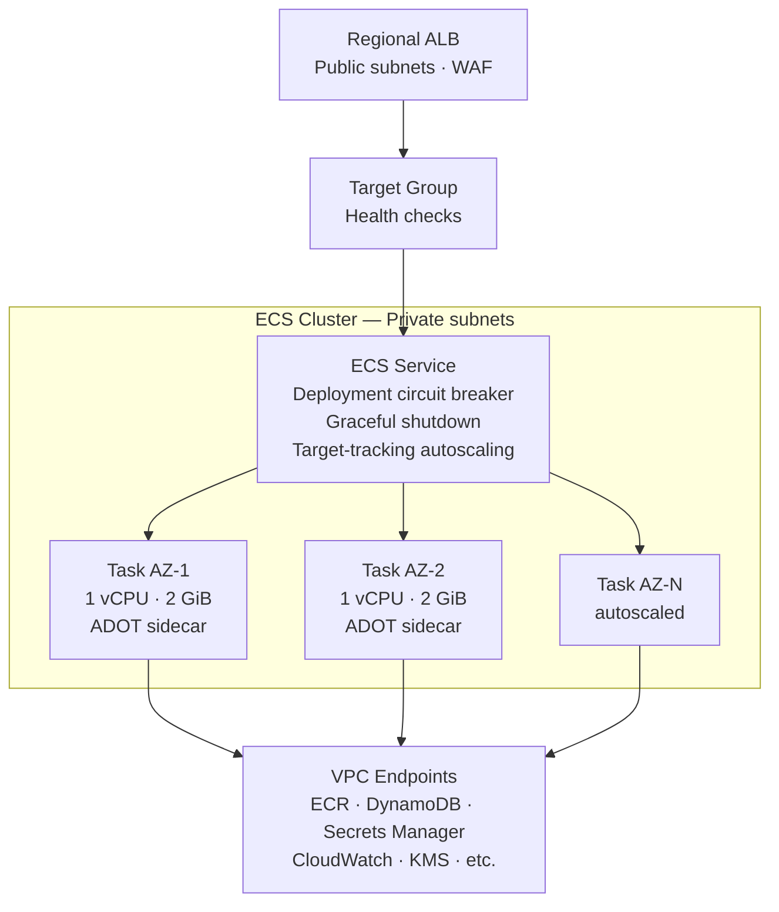
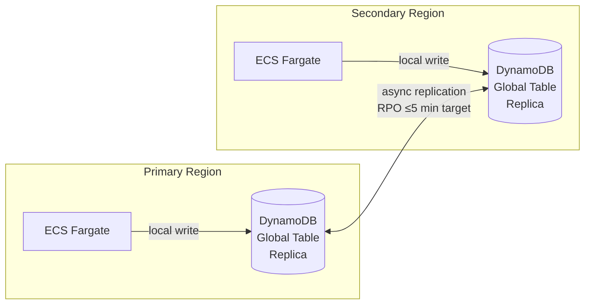
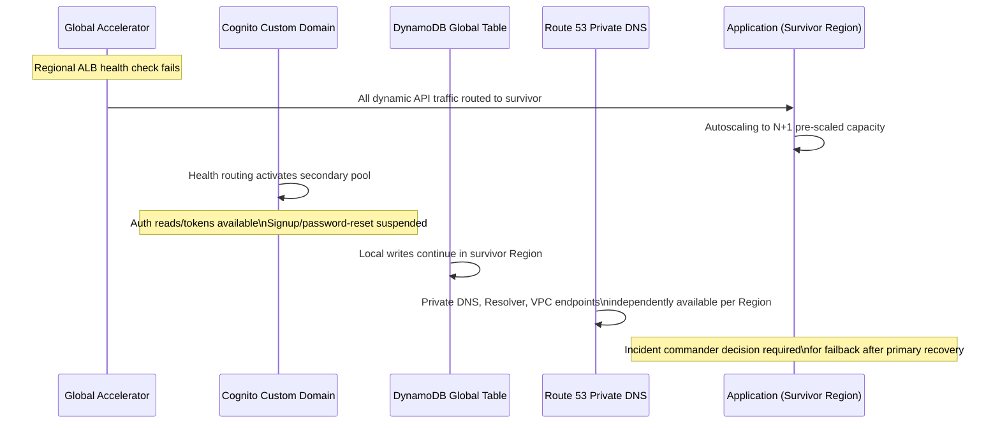

# Chapter 4 — Identity, Compute & Data

**Status:** Stakeholder-approved 2026-09-18 · No AWS resources created  
**ADRs:** [0006](../adr/0006-identity-and-authorization.md) · [0007](../adr/0007-compute-and-data.md) · [0011](../adr/0011-cognito-mrr-provider-boundary.md)

---

## 4.1 Identity architecture

### 4.1.1 Cognito primary/secondary model

Amazon Cognito User Pools is the authentication system of record. The production pool uses the **Essentials** tier with managed multi-Region replication (MRR) to one secondary Region.

**Critical constraints:**

| Operation | Primary Region | Secondary Region (during failover) |
|---|---|---|
| User signup | ✅ Available | ❌ Suspended / redirected |
| Password reset | ✅ Available | ❌ Suspended / redirected |
| Profile writes | ✅ Available | ❌ Suspended / redirected |
| Authentication / token issuance | ✅ Available | ✅ Available |
| JWT validation (local) | ✅ Available | ✅ Available |
| TOTP MFA | ✅ Available | ❌ Not supported in secondary replica |

**MRR Terraform block:** Cognito MRR is blocked pending Terraform AWS provider support (ADR 0011). It must not be substituted with imperative CLI/console steps that create unmanaged state.

### 4.1.2 Authorization model

**Cost constraint:** At 10,000 API RPS, Verified Permissions on every request ≈ 25.92B decisions/month ≈ `$129,600/month`. The design scopes Cedar to ~1% of requests (high-value decisions only) ≈ `$1,296/month`.

### 4.1.3 Human identity — IAM Identity Center

- Federated from the organization's approved identity source
- Phishing-resistant MFA where available
- Least-privilege permission sets with short-lived sessions
- No daily IAM users or long-lived access keys
- Break-glass access is a separate, monitored, time-bound process (see [runbook](../runbooks/break-glass-access.md))

---

## 4.2 Compute architecture

### 4.2.1 ECS Fargate baseline

**Fargate task configuration requirements:**
- Minimum healthy capacity in both AZs
- Deployment circuit breaker with rollback enabled
- Graceful shutdown (SIGTERM handler + `stopTimeout`)
- ADOT/OpenTelemetry instrumentation for traces, metrics, and logs
- Images from ECR with vulnerability scanning; signed-image policy when selected
- No public IP on tasks; all AWS service calls via VPC endpoints

### 4.2.2 Compute decision rationale

| Option | Decision | Reason |
|---|---|---|
| ECS Fargate | **Default** | Managed control plane, per-task billing, no cluster node management |
| Lambda | Permitted for async handlers, scheduled jobs, glue code, lightweight transforms | Not default for long-lived API until cold-start/concurrency/VPC measurements meet SLO |
| EKS | **Rejected for initial platform** | Adds Kubernetes control-plane/add-on/operations responsibilities without a supplied workload feature requiring them |

---

## 4.3 Data architecture

### 4.3.1 Data service selection

| Data class | Service | Replication model | Guardrails |
|---|---|---|---|
| User profile, session metadata, idempotency, tenant settings | DynamoDB global tables | Multi-active eventual consistency (MREC); writes are local | No passwords, plaintext secrets, or unbounded blobs; monitor replication lag and PITR |
| Strongly consistent cross-Region records | DynamoDB MRSC | Higher write-latency/availability trade-off; accepted explicitly | ADR amendment required naming the invariant, Region set, and failure behavior |
| Relational transaction data | Aurora Global Database | Single-writer failover; not multi-writer | No Aurora cluster in base platform; workload ADR must justify it |
| Hot non-authoritative reads | ElastiCache for Redis (regional) | Cache-aside; data loss never violates correctness | Sessions not Redis-only; TLS/auth required; no public endpoint |
| Immutable audit/log data | S3 in Log Archive account | Versioning · SSE-KMS · lifecycle · replication where retention dictates | Workloads cannot delete organization logs |

### 4.3.2 DynamoDB global table replication

**Mandatory DynamoDB patterns:**
- Conditional writes and version fields on all mutable items
- Idempotency keys on all write paths
- Deterministic conflict handling documented per entity type
- PITR enabled; backup/restore tested before production
- Replication lag monitored with CloudWatch alarm at RPO threshold

---

## 4.4 Regional failure behavior

