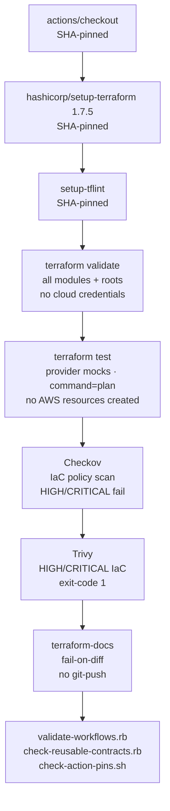
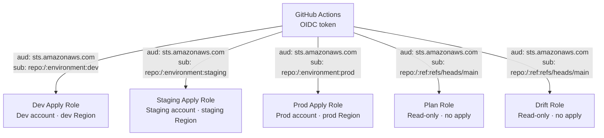
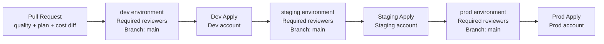
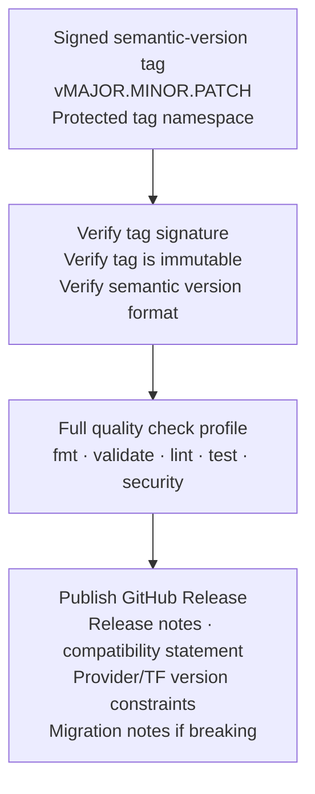

# Chapter 5 — CI/CD Pipeline Design

**Status:** Stakeholder-approved 2026-09-18 · Pipeline source locally validated — not yet active  
**ADRs:** [0012](../adr/0012-oidc-gated-terraform-delivery.md) · [0013](../adr/0013-layered-verification-no-automatic-fault-injection.md)  
**Source:** [`automation/terraform-pipelines/`](../../automation/terraform-pipelines/)

---

## 5.1 Pipeline design principles

| Principle | Implementation |
|---|---|
| No static AWS credentials | GitHub Actions OIDC only; short-lived, scoped tokens per workflow job |
| Least-privilege per stage | Separate IAM roles for quality (none), plan (read-only), apply (scoped write), drift (read-only) |
| Human gate before every apply | GitHub protected deployment environments with required reviewers |
| No automatic drift remediation | Drift detection fails the job and creates an incident signal; remediation requires normal review + apply gate |
| Immutable action supply chain | All third-party `uses:` pinned to full 40-character commit SHA |
| Plan is a review artifact, not authorization | A passing plan never auto-triggers apply |
| No secrets in logs, artifacts, or state | Backend config is ephemeral runner input; plans are not uploaded or cached |

---

## 5.2 Reusable workflow catalog

| Workflow | AWS credentials | Purpose | Required caller control |
|---|---|---|---|
| `terraform-quality.yml` | None | fmt · validate · TFLint · mocked tests · Checkov · Trivy · terraform-docs drift | Protected PR check; no AWS identity |
| `terraform-plan.yml` | OIDC plan role | Non-mutating plan + Infracost base/head cost diff | Least-privilege plan role · protected backend secret · `pull_request` event only |
| `terraform-apply.yml` | OIDC apply role | Re-plan + apply after environment approval | Environment protection · apply role · reviewed plan · serialized state access |
| `terraform-drift.yml` | OIDC drift role | Scheduled/manual read-only drift detection | Read-only drift role · external alert integration |
| `module-release.yml` | None (GitHub only) | Verify signed semantic-version tag; publish GitHub release | Protected signed tags · protected `module-release` environment |

---

## 5.3 Quality workflow — step detail



**Concurrency:** `cancel-in-progress: true` — only the latest commit on a ref runs quality checks.

---

## 5.4 OIDC trust model



**Trust policy requirements:**
- Bind `aud` to `sts.amazonaws.com`
- Bind `sub` to the exact repository + protected environment or approved ref
- AWS does not support GitHub OIDC custom claims — use only standard claims
- Remote preflight must prove a caller cannot substitute an apply role in a plan workflow

---

## 5.5 Deployment environment gates



---

## 5.6 Module release workflow



**Module release rules:**
- Tags are created only by the approved release workflow after the full check profile passes
- Tags are signed, immutable, and protected against deletion or overwrite
- Breaking interface changes require a new major version, migration instructions, and a consumer compatibility test
- Root repositories pin module references to immutable release tags — no floating branches or `latest`

---

## 5.7 Consumer caller pattern

After the pipeline repository is created and approved, callers pin to a full commit SHA:

```yaml
jobs:
  quality:
    uses: <org>/terraform-pipelines/.github/workflows/terraform-quality.yml@<FULL_40_CHAR_SHA>
    with:
      working_directory: terraform/modules/terraform-aws-vpc-workload
      check_docs: true

  plan:
    uses: <org>/terraform-pipelines/.github/workflows/terraform-plan.yml@<FULL_40_CHAR_SHA>
    with:
      working_directory: terraform/roots/network/region-a/shared
      tf_version: "1.7.5"
    secrets:
      backend_config_b64: ${{ secrets.BACKEND_CONFIG_B64 }}
      plan_role_arn: ${{ secrets.PLAN_ROLE_ARN }}
```

**Prohibited patterns:**
- `uses: <org>/terraform-pipelines/.github/workflows/terraform-plan.yml@main` — mutable ref
- `uses: <org>/terraform-pipelines/.github/workflows/terraform-plan.yml@v1` — mutable tag
- Any workflow using `pull_request_target` with AWS credentials

---

## 5.8 Remote setup sequence

Before any pipeline receives AWS access:

1. Confirm GitHub organization, team slugs, environment reviewers, repository visibility, and ruleset capabilities (assumption A-19)
2. Create the pipeline repository with protected default branch; require quality workflow, CODEOWNERS, signed commits/tags, and SHA-pinned third-party actions
3. Create separate AWS IAM OIDC roles for `plan`, `apply`, and `drift` with resource-scoped permissions
4. Configure protected GitHub environments (`dev`, `staging`, `prod`, `module-release`) with required reviewers; store backend config and `TF_VAR_*` secrets at minimum environment scope
5. Dry-run quality workflow first; then sandbox plan with no apply permission; record OIDC subject, CloudTrail events, state-lock behavior, lint/security results, and cost-diff behavior
6. Only after step 5 passes: enable apply workflow for dev environment

Full remote setup requirements: [automation/terraform-pipelines/README.md](../../automation/terraform-pipelines/README.md)
