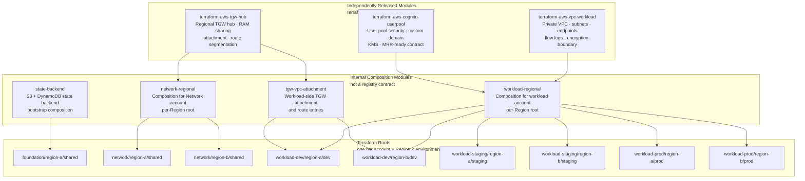

# Chapter 6 — Terraform Module Catalog

**Status:** Architecture reference; current delivery status is in [Project status](../PROJECT-STATUS.md).
**ADR:** [0010](../adr/0010-repository-and-module-topology.md)  
**Source:** [`infra/`](../../infra/README.md) — candidates are source-only; Cognito also has an active sandbox-platform module.

---

## 6.1 Module topology



---

## 6.2 Published module reference

### terraform-aws-vpc-workload

**Purpose:** Private workload VPC with IPAM allocation, private application
subnets, optional dedicated TGW attachment subnets, endpoints, Flow Logs, and
an encryption boundary.

| Input | Type | Description |
|---|---|---|
| `ipv4_ipam_pool_id` / `ipv4_netmask_length` | `string` / `number` | IPAM allocation; callers do not submit a literal VPC CIDR. The pool comes from the separately approved Network-account IPAM root. |
| `availability_zones` | AZ-keyed object map | Private application-subnet allocation plan; at least two AZs |
| `transit_gateway_attachment_subnets` | Optional AZ-keyed object map | Separate transit subnet tier; keys must exist in `availability_zones` |
| `transit_gateway_routes` | Optional map | Explicit non-default CIDRs to an approved TGW; default routes are rejected |
| `flow_log_kms_key_arn` | `string` | Customer-managed KMS key for Flow Logs |

| Output | Description |
|---|---|
| `vpc` | VPC ID, ARN, and IPAM-assigned CIDR |
| `private_subnets` | AZ-keyed private subnet, CIDR, and route-table IDs |
| `transit_gateway_attachment_subnets` | Dedicated transit-subnet and route-table IDs |
| `flow_logs` | Encrypted Flow Log and delivery-role identifiers |

**Test:** [`aws.modules.vpc` workload test](https://github.com/hatan4ik/aws.modules.vpc/tree/v0.3.0/modules/workload/tests) — provider mocks, `command = plan`, no AWS credentials.

### IPAM companion modules

`modules/ipam-organization-admin` runs only in the Organizations management
account: it enables RAM organization sharing and delegates IPAM administration
to the reviewed Network account. `modules/ipam` then runs in the IPAM home
Region in that Network account; it creates a non-allocating enterprise pool,
localized child pools, and restricted RAM shares. The IPAM root output is
promoted through a reviewed workload-root configuration change, never a
cross-account `terraform_remote_state` read. See the [IPAM delivery runbook](../runbooks/ipam-foundation.md).

---

### terraform-aws-tgw-hub

**Purpose:** Regional Transit Gateway hub with RAM sharing, route-table
segmentation, KMS-encrypted TGW Flow Logs, and a separately invoked
Network-account routing submodule.

| Input | Type | Description |
|---|---|---|
| `amazon_side_asn` | `number` | BGP ASN — must not overlap on-premises ASN |
| `ram_principals` | `set(string)` | 12-digit account IDs or Organizations organization/OU ARNs; IAM principals are rejected |
| `route_domains` | `set(string)` | Defaults to `prod`, `non-prod`, `shared`, `inspection`, and `on-prem` |
| `flow_log_retention_in_days` | `number` | At least 365 days, KMS-encrypted CloudWatch destination |
| `rejected_traffic_alarm_actions` | `set(string)` | Optional responder/incident destinations for rejected traffic |

| Output | Description |
|---|---|
| `transit_gateway` | Transit Gateway ID and ARN |
| `route_table_ids` | Map of route-table name → ID |
| `ram_resource_share_arn` | RAM resource share ARN |
| `flow_logs` | Flow Log, log group, KMS key, and rejected-traffic alarm |

The `modules/vpc-attachment` submodule creates only the workload-owned
attachment and accepts an opaque `attachment_key`, never a route domain. The
`modules/network-routing` submodule runs in the Network account, accepts the
attachment, verifies its owning account, assigns its domain from the approved
catalog, and creates explicit association, propagation, and static/blackhole
routes. This is the trust boundary for segmentation.

**Test:** [`aws.modules.tgw` tests](https://github.com/hatan4ik/aws.modules.tgw/tree/v0.2.0/tests) and [`network-routing` tests](https://github.com/hatan4ik/aws.modules.tgw/tree/v0.2.0/modules/network-routing/tests).

---

### terraform-aws-cognito-userpool

**Purpose:** Cognito user pool with security hardening, custom domain, KMS CMK, and MRR-ready configuration.

| Input | Type | Description |
|---|---|---|
| `pool_name` | `string` | User pool name |
| `kms_key_arn` | `string` | Multi-Region CMK ARN |
| `custom_domain` | `string` | e.g. `auth.example.com` |
| `acm_certificate_arn` | `string` | ACM cert in `us-east-2` for custom domain |
| `mfa_configuration` | `string` | `"ON"` or `"OPTIONAL"` — TOTP not supported in MRR secondary |
| `enable_mrr` | `bool` | Blocked — see ADR 0011 |

**MRR block:** `enable_mrr = true` is accepted as input but the resource is gated behind a `precondition` that fails until the Terraform AWS provider exposes the required resource. Do not substitute CLI/console steps.

**Test:** [`aws.modules.cognito` test](https://github.com/hatan4ik/aws.modules.cognito/tree/v0.1.1/tests)

---

## 6.3 Root layout

Every root represents exactly one `(account, Region, environment)` tuple. Roots contain only provider, backend, variable, and module-call composition — no bare AWS resources.

```
infra/candidates/roots/
  foundation/
    region-a/shared/          # State backend bootstrap — isolated procedure
  network/
    region-a/shared/          # Network account, primary Region
    region-b/shared/          # Network account, secondary Region
  workload-dev/
    region-a/dev/             # Dev workload, primary Region
    region-b/dev/             # Dev workload, secondary Region
  workload-staging/
    region-a/staging/
    region-b/staging/
  workload-prod/
    region-a/prod/
    region-b/prod/
```

**Safety rules:**
- All roots have `backend "s3" {}` with no inline configuration — backend config is supplied only after account vending and state-backend bootstrap
- `terraform.tfvars` files contain no values until a reviewed account-vending record provides account IDs, Regions, CIDRs, principals, and names
- No module contains a provider block, AWS credential, account ID, or remote-state data source
- `region-a` and `region-b` are primary/secondary source roles. Both roots consume the same reviewed Region registry, which requires distinct values and prevents a tfvars-only Region collision.

---

## 6.4 Module graduation policy

A composition module stays in its owning live-configuration repository until it meets the extraction threshold (assumption A-18):

| Threshold | Requirement |
|---|---|
| Two production consumers | OR a demonstrably separate release and ownership lifecycle |
| Evidence | ADR amendment + migration plan |
| New module requirements | Single-responsibility README · typed input/output contract · examples · `terraform test` · semantic-version plan · owners |
| Deprecation | Documented successor · migration guide · supported-version window · consumer inventory |

---

## 6.5 Provider and Terraform version constraints

| Scope | Constraint | Reason |
|---|---|---|
| Terraform CLI | `>= 1.7.0, < 2.0.0` | Provider mocking introduced in 1.7; upper bound prevents silent breaking changes |
| AWS provider (modules) | `>= 6.35.0` | Minimum version with required resource support |
| AWS provider (roots) | `~> 6.0` | Caps provider upgrades to reviewed minor versions |
| Lock files | `.terraform.lock.hcl` committed per module/root | Reproducible provider downloads |
