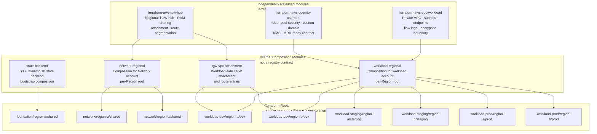

# Chapter 6 — Terraform Module Catalog

**Status:** Locally validated · No AWS resources created  
**ADR:** [0010](../adr/0010-repository-and-module-topology.md)  
**Source:** [`terraform/`](../../terraform/)

---

## 6.1 Module topology



---

## 6.2 Published module reference

### terraform-aws-vpc-workload

**Purpose:** Private workload VPC with subnets, VPC endpoints, flow logs, and encryption boundary.

| Input | Type | Description |
|---|---|---|
| `vpc_cidr` | `string` | CIDR block allocated by IPAM — no default |
| `availability_zones` | `list(string)` | Exactly 2 AZs required |
| `interface_endpoint_services` | `list(string)` | AWS service names for PrivateLink endpoints |
| `flow_log_destination_arn` | `string` | Log Archive S3 bucket ARN |
| `kms_key_arn` | `string` | CMK for flow log encryption |

| Output | Description |
|---|---|
| `vpc_id` | VPC resource ID |
| `private_subnet_ids` | List of private subnet IDs (one per AZ) |
| `tgw_attachment_subnet_ids` | Dedicated TGW attachment subnet IDs |
| `endpoint_security_group_id` | Security group for VPC endpoints |

**Test:** `terraform/modules/terraform-aws-vpc-workload/tests/vpc_workload.tftest.hcl` — provider mocks, `command = plan`, no AWS credentials.

---

### terraform-aws-tgw-hub

**Purpose:** Regional Transit Gateway hub with RAM sharing, route-table segmentation, and attachment management.

| Input | Type | Description |
|---|---|---|
| `amazon_side_asn` | `number` | BGP ASN — must not overlap on-premises ASN |
| `ram_principal_arns` | `list(string)` | Account ARNs to receive RAM share |
| `route_table_names` | `list(string)` | `["prod","non-prod","shared","inspection","on-prem"]` |
| `enable_default_route_table_association` | `bool` | Must be `false` |
| `enable_default_route_table_propagation` | `bool` | Must be `false` |

| Output | Description |
|---|---|
| `tgw_id` | Transit Gateway resource ID |
| `tgw_arn` | Transit Gateway ARN for RAM sharing |
| `route_table_ids` | Map of route-table name → ID |
| `ram_share_arn` | RAM resource share ARN |

**Test:** `terraform/modules/terraform-aws-tgw-hub/tests/tgw_hub.tftest.hcl`

---

### terraform-aws-cognito-userpool

**Purpose:** Cognito user pool with security hardening, custom domain, KMS CMK, and MRR-ready configuration.

| Input | Type | Description |
|---|---|---|
| `pool_name` | `string` | User pool name |
| `kms_key_arn` | `string` | Multi-Region CMK ARN |
| `custom_domain` | `string` | e.g. `auth.example.com` |
| `acm_certificate_arn` | `string` | ACM cert in `us-east-2` for custom domain |
| `mfa_configuration` | `string` | `"ON"` or `"OPTIONAL"` — TOTP not supported in MRR secondary |
| `enable_mrr` | `bool` | Blocked — see ADR 0011 |

**MRR block:** `enable_mrr = true` is accepted as input but the resource is gated behind a `precondition` that fails until the Terraform AWS provider exposes the required resource. Do not substitute CLI/console steps.

**Test:** `terraform/modules/terraform-aws-cognito-userpool/tests/cognito_userpool.tftest.hcl`

---

## 6.3 Root layout

Every root represents exactly one `(account, Region, environment)` tuple. Roots contain only provider, backend, variable, and module-call composition — no bare AWS resources.

```
terraform/roots/
  foundation/
    region-a/shared/          # State backend bootstrap — isolated procedure
  network/
    region-a/shared/          # Network account, primary Region
    region-b/shared/          # Network account, secondary Region
  workload-dev/
    region-a/dev/             # Dev workload, primary Region
    region-b/dev/             # Dev workload, secondary Region
  workload-staging/
    region-a/staging/
    region-b/staging/
  workload-prod/
    region-a/prod/
    region-b/prod/
```

**Safety rules:**
- All roots have `backend "s3" {}` with no inline configuration — backend config is supplied only after account vending and state-backend bootstrap
- `terraform.tfvars` files contain no values until a reviewed account-vending record provides account IDs, Regions, CIDRs, principals, and names
- No module contains a provider block, AWS credential, account ID, or remote-state data source
- `region-a` and `region-b` are source-layout placeholders — never AWS deployment targets

---

## 6.4 Module graduation policy

A composition module stays in its owning live-configuration repository until it meets the extraction threshold (assumption A-18):

| Threshold | Requirement |
|---|---|
| Two production consumers | OR a demonstrably separate release and ownership lifecycle |
| Evidence | ADR amendment + migration plan |
| New module requirements | Single-responsibility README · typed input/output contract · examples · `terraform test` · semantic-version plan · owners |
| Deprecation | Documented successor · migration guide · supported-version window · consumer inventory |

---

## 6.5 Provider and Terraform version constraints

| Scope | Constraint | Reason |
|---|---|---|
| Terraform CLI | `>= 1.7.0, < 2.0.0` | Provider mocking introduced in 1.7; upper bound prevents silent breaking changes |
| AWS provider (modules) | `>= 6.35.0` | Minimum version with required resource support |
| AWS provider (roots) | `~> 6.0` | Caps provider upgrades to reviewed minor versions |
| Lock files | `.terraform.lock.hcl` committed per module/root | Reproducible provider downloads |
