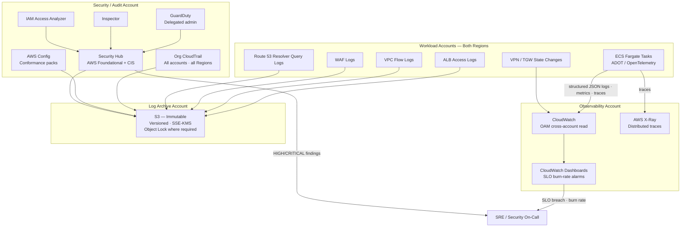
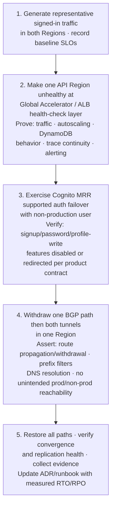

# Chapter 7 — SRE, Observability & Recovery

**Status:** Target operating design — not deployed; current capability is in
[Project status](../PROJECT-STATUS.md).
**ADR:** [0009](../adr/0009-observability-and-sre.md)  
**Runbooks:** [docs/runbooks/](../runbooks/)

---

> **Target design — not deployed:** the evidence and runbook model below is
> the desired multi-account operating state, not proof that its target services
> or alerting integrations exist today.

## 7.1 Service Level Objectives

| Service | SLI | Target | Page condition |
|---|---|---|---|
| API | Availability | 99.99% / calendar month | Regional 5xx, saturation, or p99 breach consuming error budget at configured burn rate |
| API | Latency p50 | ≤100 ms regional service time | — |
| API | Latency p99 | ≤250 ms regional service time | p99 breach at burn rate |
| Authentication journey | Availability | 99.9% | Cognito throttle/error, managed-login health, MRR replication, or token-validation failure |
| Authentication journey | Latency p50 | ≤250 ms | — |
| Authentication journey | Latency p99 | ≤600 ms | p99 breach at burn rate |
| DynamoDB replication | MREC lag | ≤5 min RPO target | Replica degradation, replication lag, conditional-write conflict increase, or backup failure |
| VPN/BGP | Tunnel health | Both tunnels/paths healthy per Region | One path degraded: ticket; both paths down: page |
| Security baseline | Finding SLA | Zero unacknowledged HIGH findings post-deploy | New HIGH/CRITICAL, disabled trail/Config/GuardDuty, unauthorized public exposure |

**Scope note:** Latency SLOs exclude end-user ISP/mobile last-mile and third-party IdP latency. They include platform edge, load balancer, application, authorization, and AWS service time.

---

## 7.2 Telemetry architecture

---

## 7.3 Observability stack

| Signal | Source | Destination | Retention |
|---|---|---|---|
| Application logs | ADOT → CloudWatch Logs | Observability account (OAM) + Log Archive S3 | Per approved lifecycle policy |
| Application metrics | ADOT → CloudWatch Metrics | Observability account (OAM) | Per approved lifecycle policy |
| Distributed traces | ADOT → X-Ray | Observability account | Per approved lifecycle policy |
| ALB access logs | ALB → S3 | Log Archive | Per approved lifecycle policy |
| VPC Flow Logs | VPC → S3 / CloudWatch | Log Archive | Per approved lifecycle policy |
| WAF logs | WAF → S3 / Kinesis | Log Archive | Per approved lifecycle policy |
| CloudTrail | Org trail → S3 | Log Archive (immutable) | Per approved lifecycle policy |
| Config snapshots | Config → S3 | Log Archive | Per approved lifecycle policy |
| GuardDuty findings | GuardDuty → Security Hub | Security/Audit account | Per approved lifecycle policy |
| Security Hub findings | Security Hub → EventBridge | On-call integration | Per approved lifecycle policy |

**Retention note:** KMS key pending-deletion period, state version-retention period, and Object Lock mode/retention are organization decisions with no deployable defaults (assumption A-21).

---

## 7.4 Runbook minimum evidence requirements

| Runbook | Required completion evidence |
|---|---|
| [Regional API failover](../runbooks/regional-failover.md) | Health signal · Global Accelerator endpoint state · capacity in survivor Region · API synthetic test · incident record · controlled failback |
| [Cognito MRR failover](../runbooks/regional-failover.md) | MRR replica status · Cognito custom-domain health routing · direct API/SDK regional routing · supported login test · documented primary-only feature limitation · recovery test |
| [Hybrid connectivity outage](../runbooks/hybrid-vpn-bgp-onboarding.md) | Both VPN tunnel/BGP state · prefix advertisements · TGW route-table state · Resolver lookup · customer-edge confirmation · rollback/failover result |
| [Break-glass access](../runbooks/break-glass-access.md) | Approved incident ticket · MFA/identity evidence · temporary permission duration · CloudTrail review · credential/permission removal · post-incident review |
| [Security finding](../runbooks/README.md) | Finding ID · affected account/Region · containment · evidence preservation · remediation owner · SLA · exception expiry if approved |

---

## 7.5 Staging game day — required before production

No production region-failover claim is valid until this game day passes with the chosen Regions, current service quotas, workload build, and on-premises devices.

**Change window:** Game day requires an approved change window, a named incident commander, and a documented rollback plan before execution.
