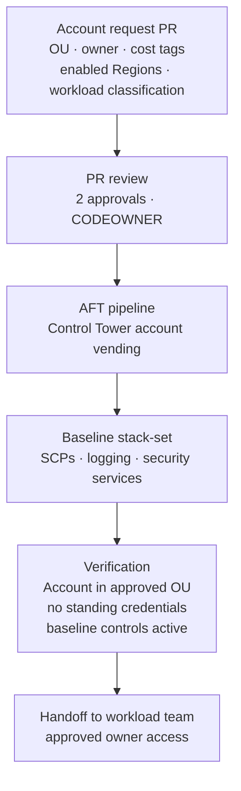
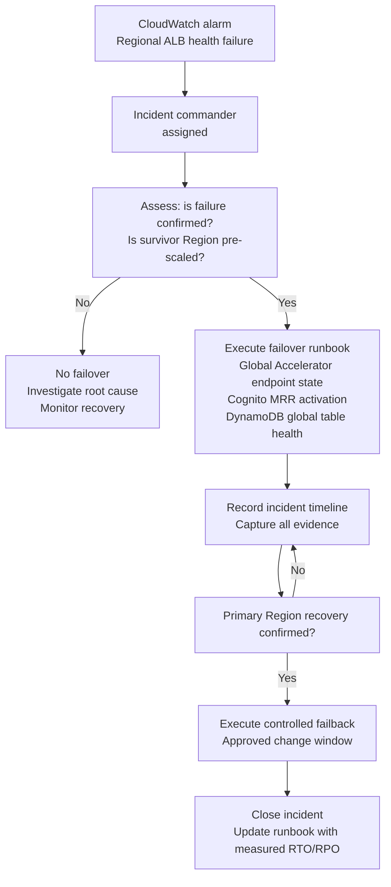

# Chapter 10 — Operational Runbooks

**Status:** Documented — not yet executable (no deployed resources)  
**Source:** [`docs/runbooks/`](../runbooks/)

> Runbooks are execution gates, not evidence that a resource already exists. They must be tailored with approved account IDs, Regions, change ticket, on-call integrations, and owner contacts before an operator executes them.

---

## 10.1 Runbook index

| Runbook | Trigger | Non-negotiable completion evidence |
|---|---|---|
| [Account vending](../runbooks/account-vending.md) | New governed AWS account required | Account in approved OU · baseline controls/logging active · no standing credentials · approved owner access |
| [Adding a Region](../runbooks/adding-region.md) | Platform/environment expansion to a new AWS Region | Quotas · IPAM/TGW/DNS/data/identity checks · post-deploy tests · staging game day |
| [Hybrid VPN/BGP onboarding](../runbooks/hybrid-vpn-bgp-onboarding.md) | Connect on-premises routing domain to regional TGW | Two healthy tunnels/paths · prefix filters · isolation checks · recorded rollback |
| [Regional failover](../runbooks/regional-failover.md) | Controlled application regional failover | Health signal · traffic shift · auth/API/data validation · incident timeline · controlled failback |
| [Break-glass access](../runbooks/break-glass-access.md) | Critical incident requiring exceptional access | Approval · MFA/session evidence · CloudTrail review · privilege removal · post-incident review |
| [AWS access bootstrap](../runbooks/bootstrap-aws-access.md) | Establish approved human access | IAM Identity Center session · account identity evidence · no standing credentials |
| [Legacy state-backend adoption](../runbooks/adopt-legacy-state-backend.md) | Re-address the observed state backend | Protected backup · active-lock check · declarative no-change plan · specialist approvals |
| [Terraform state restore](../runbooks/state-restore.md) | Recover corrupt state metadata | Approved S3 version · rollback copy · refresh-only plan · CloudTrail review |
| [Planned regional evacuation](../runbooks/regional-evacuation.md) | Withdraw a Region after migration | Data/identity/traffic/route evidence · rollback decision · approved decommission |
| [Account decommission](../runbooks/account-decommission.md) | Retire a governed account | Retention · dependencies · state · billing · closure evidence |

---

## 10.2 Account vending — process overview

---

## 10.3 Regional failover — decision tree

---

## 10.4 Break-glass access — controls

Break-glass access is a separately monitored, time-bound process. It is never a routine operation.

| Step | Control |
|---|---|
| 1. Raise incident ticket | Approved incident ticket with justification required before any access |
| 2. MFA verification | Phishing-resistant MFA evidence recorded |
| 3. Temporary permission grant | Time-bound; minimum scope for the specific incident |
| 4. CloudTrail monitoring | All actions logged to immutable Log Archive; Security team notified in real time |
| 5. Credential/permission removal | Removed immediately after incident resolution; not left for scheduled cleanup |
| 6. Post-incident review | CloudTrail review · access scope assessment · process improvement if needed |

---

## 10.5 Runbook execution rules

- No runbook permits changing AWS or GitHub from this local workspace
- Remote-change and apply gates in the architecture and pipeline documentation remain in force
- Post-deployment scripts are deliberately read-only; they provide objective evidence, not mutation
- Controlled fault injection and production failover remain manual, change-approved operations
- Every runbook execution produces a change record with evidence before the window closes
