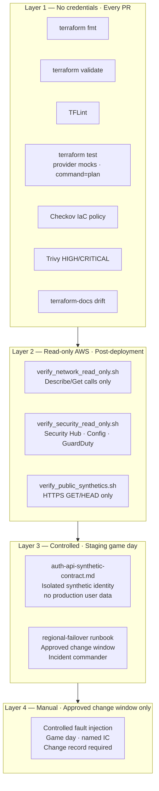

# Chapter 11 — Verification & Testing Strategy

**Status:** Test contracts locally validated — not yet executable (no deployed resources)  
**ADR:** [0013](../adr/0013-layered-verification-no-automatic-fault-injection.md)  
**Source:** [`tests/`](../../tests/)

---

## 11.1 Verification layer model



**Core rule (ADR 0013):** No automatic disruptive testing. Controlled fault injection and production failover are manual, change-approved operations only.

---

## 11.2 Layer 1 — Module contract tests

| Test file | Module | What it validates |
|---|---|---|
| `aws.modules.vpc@v0.3.0//modules/workload/tests` | vpc-workload | VPC, subnet, endpoint, flow-log resource plan with provider mocks |
| `aws.modules.tgw@v0.2.0/tests` | tgw-hub | TGW, route tables, RAM share, attachment plan with provider mocks |
| `aws.modules.cognito@v0.1.1/tests` | cognito-userpool | User pool, custom domain, KMS, MRR block plan with provider mocks |

**Execution:** `terraform test` from each module directory. Requires Terraform ≥ 1.7.0. Uses `command = plan` — no AWS resources created, no credentials required.

**Static policy:** Checkov and Trivy run against all `infra/` source. HIGH or CRITICAL findings fail the pipeline with no soft-fail. Suppressions require an approved, expiring, justified entry.

---

## 11.3 Layer 2 — Post-deployment read-only checks

All scripts require concrete deployed identifiers as command-line arguments. No defaults exist — a developer cannot accidentally test an invented account or Region.

### verify_network_read_only.sh

```
Usage: verify_network_read_only.sh \
  --account-id <ACCOUNT_ID> \
  --region <REGION> \
  --tgw-id <TGW_ID> \
  --vpc-id <VPC_ID>
```

Checks: TGW state · route-table associations · VPN tunnel health · Resolver endpoint status · VPC endpoint state · Flow Log delivery

### verify_security_read_only.sh

```
Usage: verify_security_read_only.sh \
  --account-id <ACCOUNT_ID> \
  --region <REGION> \
  --config-recorder-name <NAME>
```

Checks: CloudTrail enabled · Config recorder active · GuardDuty enabled · Security Hub standards active · Zero unacknowledged HIGH/CRITICAL findings

Exits non-zero on any active HIGH/CRITICAL Security Hub finding.

### verify_public_synthetics.sh

```
Usage: verify_public_synthetics.sh \
  --api-endpoint https://<API_FQDN> \
  --auth-endpoint https://auth.<DOMAIN>
```

Checks: HTTPS reachability · TLS certificate validity · HTTP response codes · Regional health-check endpoints

HTTPS GET/HEAD only — no user credentials, no mutation.

---

## 11.4 Layer 3 — AuthN/AuthZ synthetic contract

The [auth-api-synthetic-contract.md](../../tests/post_deploy/auth-api-synthetic-contract.md) defines the required assertions for the authentication and authorization journey:

| Assertion | Method |
|---|---|
| Cognito token issuance in primary Region | Isolated synthetic user — no production credentials |
| JWT validation by API service | Synthetic API call with issued token |
| Coarse authorization (JWT claims) | Synthetic call to scope-restricted endpoint |
| Fine-grained authorization (Verified Permissions) | Synthetic call to Cedar-gated endpoint |
| Regional routing (primary → secondary failover) | Synthetic call after health-check manipulation in staging |
| MRR secondary authentication | Synthetic auth call routed to secondary pool endpoint |
| Primary-only feature suspension | Verify signup/password-reset returns expected error in secondary |

**Isolation requirement:** Uses an approved isolated synthetic identity. No production user data or secrets appear in output or logs.

---

## 11.5 Mutation boundary summary

| Layer | Mutation allowed | AWS credentials required |
|---|---|---|
| Module contract tests | None — `command = plan` only | No |
| Static IaC policy (Checkov/Trivy) | None — source scan only | No |
| Network read-only verification | None — `Describe`/`Get` only | Yes — read-only role |
| Security read-only verification | None — read calls only | Yes — read-only role |
| Public synthetics | None — HTTPS GET/HEAD only | No |
| AuthN/AuthZ synthetic contract | None — isolated synthetic identity | Yes — synthetic user only |
| Staging game day / failover | Controlled health-check manipulation only | Yes — approved change window |
| Production failover | Manual, incident-commander-authorized only | Yes — break-glass or approved role |

---

## 11.6 What these tests do NOT prove

| Claim | Why it is not proven by local tests |
|---|---|
| "The platform is deployed" | No AWS account, Region, or resource has been created |
| "Failover works in production" | No live network/security/authentication/failover assertion has run |
| "The OIDC trust policy is correct" | Remote preflight must prove caller cannot substitute a higher-privilege role |
| "SLOs are met" | Requires synthetic tests from user geographies with real workload traffic |
| "Cognito MRR is functional" | Blocked by ADR 0011; not deployed or tested |
| "The game day passes" | Requires chosen Regions, current service quotas, workload build, and on-premises devices |
