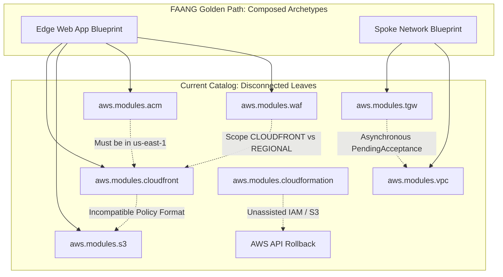
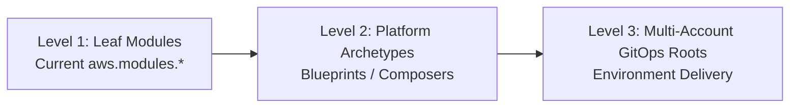

# Comprehensive FAANG/Principal Engineering Audit: `hatan4ik/aws.modules.*`

> **Dated assessment record:** This report captures the module catalog as it
> was reviewed on October 6, 2026. Several findings were remediated after the
> evidence was collected, so the scores and gap statements below are not a
> declaration of current platform state. Use the
> [module catalog](../../MODULE-REPOSITORIES.md),
> [architecture overview](../../ARCHITECTURE.md), and repository release
> history for current decisions and immutable module versions.

**Auditor:** Principal Cloud Architect / Top 1% Platform Engineer Evaluation

**Date:** October 6, 2026

**Scope:** 20 Platform Repositories under `github.com/hatan4ik/aws.modules.*`

**Status:** Historical assessment; remediation must be verified against current releases

---

## 1. Executive Summary

A comprehensive architectural and operational analysis was conducted across all 20 repositories in the `hatan4ik/aws.modules.*` platform catalog:

| Repository | Domain | Architectural Purpose |
| :--- | :--- | :--- |
| `aws.modules.acm` | Security / Identity | Public, private (Private CA), and imported TLS certificates with DNS validation. |
| `aws.modules.alb` | Edge / Compute | Regional Application Load Balancers, listeners, routing rules, target groups. |
| `aws.modules.cloudformation` | Orchestration | CloudFormation stacks, StackSets, self-managed and service-role submodules. |
| `aws.modules.cloudfront` | Edge / Content | Global CDN distributions, OAC, cache policies, custom error responses. |
| `aws.modules.cognito` | Identity | User pools, OAuth clients, custom scopes, password/MFA policies. |
| `aws.modules.dynamodb` | Data / Storage | Production DynamoDB tables, autoscaling, streams, replicas, PITR. |
| `aws.modules.ecs` | Platform Compute | Cluster foundation, application logs, shared KMS key, VPC endpoints. |
| `aws.modules.ecs-service` | Workload Compute | Fargate task definitions, services, autoscaling, derived IAM policies. |
| `aws.modules.global-accelerator` | Edge / Network | Anycast IP routing, listeners, regional endpoint groups. |
| `aws.modules.iam` | Governance / CI/CD | Sandbox delivery identity, OIDC trust policies, scoped permissions. |
| `aws.modules.ksm` *(KMS)* | Security / Cryptography | Customer-managed KMS keys, key policies, multi-region replicas. |
| `aws.modules.naming` | Governance | Standardized naming conventions, tag propagation, prefix contracts. |
| `aws.modules.resource-groups` | Operations | Resource Groups query, tag filters, CloudFormation stack scoping. |
| `aws.modules.route53` | Network / DNS | Public/private zones, records, health checks, DNSSEC, query logging. |
| `aws.modules.s3` | Storage | Secure S3 buckets, bucket policies, encryption, lifecycle, replication. |
| `aws.modules.security-group` | Network / Security | Standalone security groups, ingress/egress rules, self-referential rules. |
| `aws.modules.state` | Platform State | S3 backend tiers, Object Lock, DynamoDB lock tables, legacy adoption. |
| `aws.modules.tgw` | Network Hub | Regional Transit Gateway hub, route domains, RAM shares, attachments. |
| `aws.modules.vpc` | Network Foundation | VPC, multi-tier subnets, route tables, NAT/IGW, VPC endpoints, IPAM. |
| `aws.modules.waf` | Edge / Security | WAFv2 Web ACLs, managed rule groups, rate limiting, logging. |

### Overall Assessment
* **HCL Craftsmanship & Unit Quality (9.5 / 10):** Exceptional adherence to modern Terraform patterns (Terraform >= 1.7), strict UTF-8 input bounds checking, XOR variable validations, advisory `checks.tf` blocks, automated `.tflint.hcl`, Trivy, Checkov, and thorough `.tftest.hcl` test suites using mock providers.
* **Platform Integration & Developer Journey (4.5 / 10):** Over-indexed on strict academic isolation ("Single Responsibility Principle"). The catalog is composed almost entirely of **disconnected leaf nodes**. It offloads the hardest 80% of platform engineering—cross-module dependency chaining, asynchronous multi-account handshakes, prerequisite IAM role bootstrapping, and regional provider alignment—onto the consuming application developer without providing **Level 2 (L2) Composed Blueprints**.

---

## 2. The Core Dilemma: Ivory Tower Isolation vs. Platform Velocity

Across the design documents (`docs/DESIGN.md`) in almost every repository, the author repeats a strict dogma:
> *"The module deliberately does NOT create X, Y, or Z because they have separate lifecycles and owners. The module consumes their identifiers."*

While theoretically pure, in enterprise platform engineering (especially at FAANG/MANGA scale), **this creates an architectural trap known as the "Prerequisite Cliff."**



A developer attempting to deploy a real service must assemble 6 to 10 leaf modules from scratch, resolve conflicting output shapes, navigate AWS provider regional aliasing traps, and write manual IAM boilerplate.

---

## 3. Deep-Dive Audit: The Top 5 Broken Chains

### 1. Incompatible Sibling Contracts (The "Translation Tax")
In a unified platform catalog, sibling modules must share a common schema contract. Currently, modules within this catalog cannot talk to each other without custom translation code written by the caller.

* **Exhibit A: `aws.modules.cloudfront` $\rightarrow$ `aws.modules.s3`**
  * `aws.modules.cloudfront` outputs:
    ```hcl
    output "required_bucket_policy_json" {
      description = "The exact IAM policy STATEMENT as a JSON string... translate it into aws.modules.s3's own typed bucket_policy_statements input (its principals and conditions fields have a different shape than raw IAM JSON)..."
    }
    ```
  * `aws.modules.s3` expects:
    ```hcl
    variable "bucket_policy_statements" {
      type = map(object({
        sid        = optional(string)
        effect     = optional(string, "Allow")
        principals = list(object({ type = string, identifiers = list(string) }))
        actions    = list(string)
        conditions = list(object({ test = string, variable = string, values = list(string) }))
      }))
    }
    ```
  * **The Problem:** The author explicitly acknowledges in the description that the caller must translate raw JSON into `aws.modules.s3`'s custom typed HCL object! Consuming developers are forced to write `jsondecode()` hacks or manually reconstruct the policy blocks.
* **Exhibit B: `aws.modules.waf` $\rightarrow$ `aws.modules.s3` (Logging Trap)**
  * AWS WAF requires S3 logging buckets to strictly match the prefix `aws-waf-logs-*`.
  * `aws.modules.s3` does not provide an enum, helper, or assertion for WAF logging compatibility. If a developer uses standard platform naming via `aws.modules.naming`, AWS WAF rejects the bucket at apply time with an opaque API error.

---

### 2. The `us-east-1` Regional Gravity Trap
AWS has hardcoded architectural gravity towards `us-east-1` for global services. When a platform standardizes on another region (such as `us-east-2`, as enforced by our organization SCPs), severe cross-region provider mismatches occur.

* **Exhibit A: CloudFront + ACM + WAF**
  * `aws.modules.cloudfront` accepts `viewer_certificate_arn` and `web_acl_arn`.
  * Both the ACM Certificate and the WAF Web ACL **must reside in `us-east-1`**.
  * `aws.modules.acm` and `aws.modules.waf` assume the caller's default provider. If the caller deploys in `us-east-2`, applying `acm` and `waf` creates `us-east-2` resources that CloudFront will reject at apply time with `InvalidViewerCertificate` or `WAFInvalidParameter`.
  * **The Missing FAANG Pattern:** No provider aliasing assertions or compile-time region guards (`aws:region == "us-east-1"`) on CloudFront-scoped resources.
* **Exhibit B: Route 53 Query Logging**
  * `aws.modules.route53` supports `query_logging`.
  * CloudWatch Log Groups for Route 53 public DNS query logging **must be located in `us-east-1`**. The module takes a log group ARN, but provides no guidance or check ensuring the ARN points to `us-east-1`.

---

### 3. Asynchronous Multi-Account Orchestration Deadlocks
* **Exhibit: `aws.modules.tgw` $\leftrightarrow$ `aws.modules.vpc`**
  * In `aws.modules.tgw/modules/vpc-attachment`, the spoke account requests an attachment to a Transit Gateway shared via RAM.
  * The attachment is created in state `pendingAcceptance`.
  * The network hub account must run `modules/network-routing` to accept the attachment, associate it with a route domain table, and propagate routes.
  * Only *after* the hub accepts can the spoke VPC add default routes pointing to `tgw-xxxx`.
  * **The Failure Mode:** If an application team writes a Terraform root combining `aws.modules.vpc` and `tgw/modules/vpc-attachment` and includes a route to the TGW, `terraform apply` crashes or creates blackholed routes because the attachment was not yet accepted in the hub account.
  * **FAANG Solution:** An asynchronous state machine or a phased GitOps workflow contract that gates route creation behind an EventBridge/Lambda or cross-account SSM parameter state check.

---

### 4. Cryptographic Key Policy Chaining (`aws.modules.ksm`)
* **Exhibit A: The Repository Naming Typo**
  * The repository is officially named `aws.modules.ksm` instead of `aws.modules.kms`.
  * While `docs/DESIGN.md` admits this is historical, at Top 1% FAANG standards, core security primitives should not maintain visible typos in module source URLs (`github.com/hatan4ik/aws.modules.ksm`), as it breaks automated dependency scanners, naming linters, and developer trust.
* **Exhibit B: Confused Deputy & Service Principal Chaining**
  * When KMS is used by CloudWatch Logs (for ECS Exec or VPC Flow Logs), CloudWatch requires service principal `logs.<region>.amazonaws.com` with `kms:EncryptedDataKey` permissions.
  * When KMS is used by S3 with CloudFront OAC, KMS key policy requires `cloudfront.amazonaws.com` with condition `AWS:SourceArn = distribution.arn`.
  * `aws.modules.ksm` provides a `key-policy` submodule, but lacks pre-baked service presets for S3, CloudWatch Logs, and Secrets Manager. Callers must manually construct complex JSON statements.

---

### 5. Multi-Region DR Punting (`aws.modules.cognito` & `aws.modules.state`)
* **Exhibit A: Cognito Multi-Region Disaster Recovery**
  * In `aws.modules.cognito/docs/DESIGN.md`:
    > *"It deliberately does not create identity providers, hosted-UI domains, or a second (replica) pool."*
  * In a multi-region active-active or active-passive architecture (e.g. `us-east-2` and `us-west-2`), user identity is the single most critical failure domain. Because AWS does not offer native cross-region user pool replication, a Top 1% FAANG platform provides an event-driven sync pattern (DynamoDB Global Tables + Cognito Triggers) or an explicit DR failover runbook. Punting this out of scope leaves product teams stranded.
* **Exhibit B: State Backend Replica KMS Dependencies**
  * In `aws.modules.state`, replication to a second region requires multi-region KMS keys and an `aws.replica` provider alias.
  * If the replica region's KMS key policy fails to grant S3 replication role decrypt/re-encrypt permissions, S3 replication fails silently while Terraform state reports a successful apply.

---

## 4. Module-by-Module Gap Analysis Matrix

| Module | Architectural Strengths | Top 1% FAANG Gaps / Integration Friction |
| :--- | :--- | :--- |
| **`acm`** | Automatic Route 53 longest suffix match; waits for validation by default. | No cross-account Route 53 delegation role; no enforcement of `us-east-1` for CloudFront certificates. |
| **`alb`** | Strong interface contract with `ecs-service` (`target_group_arns`, `listener_rule_arns`). | ELB access logging policy setup is left to caller; certificate validation race conditions if `wait_for_validation = false`. |
| **`cloudformation`** | Added `self-managed-roles` submodule and `self-managed-bootstrap` example. | Missing S3 template CI/CD artifact immutability pipeline; no `cfn-lint` pre-flight validation in CI. |
| **`cloudfront`** | Excellent OAC and cache behavior modeling. | Incompatible bucket policy output format with `aws.modules.s3`; requires manual `us-east-1` provider plumbing. |
| **`cognito`** | Strong MFA, password policy, and custom scope typing. | No multi-region synchronization pattern; custom domains require unassisted `us-east-1` ACM certificates. |
| **`dynamodb`** | Clean autoscaling submodule; eliminates drift between TF and Application Auto Scaling. | Missing global secondary index backfill failure handling for large existing datasets. |
| **`ecs`** | Composes endpoints from `vpc//modules/endpoints`; clean separation of registry and session store. | Hardcoded single-account assumption; doesn't provide service discovery (Cloud Map) foundation. |
| **`ecs-service`** | Exceptional derived IAM policy generator for declared secrets and KMS keys. | Blue/Green deployments require external CodeDeploy configuration not provisioned or guided by the module. |
| **`global-accelerator`**| Clean endpoint group mapping and health check integration. | Dial-percentage traffic shifting is manual; lacks integration with CloudWatch synthetic canaries. |
| **`iam`** | Clean OIDC GitHub Actions identity with scoped trust policies. | Tailored exclusively for sandbox delivery; lacks general workload role factory with Permission Boundaries. |
| **`ksm`** | Multi-region replica support; clean alias management. | Typo in repo name (`ksm`); lacks standard service-policy presets (CloudWatch, S3 OAC, SecretsManager). |
| **`naming`** | Deterministic tag and name contract across the platform. | Static regex; doesn't dynamically query or validate against AWS character limits per resource type (e.g., S3 vs TGW). |
| **`resource-groups`** | Clean query modeling and capacity reservation pool support. | Rare standalone utility; seldom consumed by the other 19 modules. |
| **`route53`** | Covers all routing policies, DNSSEC, and typed health checks. | Query logging requires unguided `us-east-1` CloudWatch log group; no automated parent-zone NS delegation handshake. |
| **`s3`** | Robust baseline: TLS 1.2 enforcement, SSE-KMS, Object Lock, EventBridge. | Policy schema is incompatible with `cloudfront`'s output; lacks built-in presets for ALB/WAF access logs. |
| **`security-group`** | Elegant solution to self-referencing cluster rules without cycle errors. | Rules are managed as separate resources, risking rule sprawl and quota exhaustion if not carefully audited. |
| **`state`** | `prevent_destroy` guards; legacy adoption submodule; S3 native lockfile support. | Access log bucket is an unassisted input; replication failures are silent at plan time. |
| **`tgw`** | Deny-by-default route domains; RAM sharing; appliance mode support. | Multi-account attachment handshake requires out-of-band coordination; spoke route creation races pending attachments. |
| **`vpc`** | Highly modular: IPAM, endpoints, NAT, flow logs. | Interface endpoints do not automatically export security group rules allowing specific workload subnets. |
| **`waf`** | WCU capacity computation; rate-limiting and managed rule support. | Scope (`CLOUDFRONT` vs `REGIONAL`) changes provider requirements without compile-time warnings; S3 logging prefix constraint unassisted. |

---

## 5. Strategic Roadmap: How to Elevate to Top 1% FAANG Level

To bridge the gap between individual HCL leaf perfection and a true enterprise platform, the following three-step evolution should be implemented:



### Action 1: Introduce Level 2 (L2) Composed Archetypes
Create companion modules (or a `blueprints/` directory) that package the leaves into zero-friction Golden Paths:
1. **`blueprint-edge-web-app`**: Chains Route 53 $\rightarrow$ CloudFront (with `us-east-1` provider) $\rightarrow$ WAFv2 $\rightarrow$ S3 Origin with automatically wired OAC bucket policies.
2. **`blueprint-microservice-private`**: Chains VPC Private Subnets $\rightarrow$ ALB Target Group $\rightarrow$ ECS Fargate Service $\rightarrow$ Scoped Task Execution Role + KMS Decrypt grant.
3. **`blueprint-network-spoke`**: Chains VPC $\rightarrow$ TGW Spoke Attachment $\rightarrow$ Automatic RAM share consumption.

### Action 2: Unify the Policy Contract (Eliminate the Translation Tax)
* Standardize on a single policy representation across all modules.
* Update `aws.modules.s3` to accept raw IAM policy statement maps (or update `aws.modules.cloudfront` to output `s3`-compatible statement objects).

### Action 3: Enforce Regional Provider Aliases at Plan Time
For modules that interact with `us-east-1` global services (`cloudfront`, `acm`, `waf`, `route53`), add an explicit `configuration_aliases = [aws.us_east_1]` in `versions.tf` and validate:
```hcl
data "aws_region" "current" {}

lifecycle {
  postcondition {
    condition     = data.aws_region.current.name == "us-east-1"
    error_message = "This resource must be provisioned with an AWS provider in us-east-1."
  }
}
```

### Action 4: Fix Repository Naming & Deprecate Typos
* Rename `aws.modules.ksm` to `aws.modules.kms` (with GitHub repository redirect and a clean migration changelog).

---

## 6. Conclusion

The `hatan4ik/aws.modules.*` catalog represents **top-tier Terraform engineering at the individual resource level**. The code is clean, defensive, and rigorously tested with mock providers.

However, it currently operates as an **assembly of isolated parts rather than a cohesive developer platform**. By implementing L2 composition blueprints, standardizing policy exchange schemas, and building bridges across the multi-account / cross-region boundaries, this platform catalog will achieve true **Top 1% FAANG Platform Engineering** maturity.
